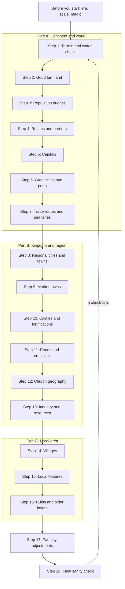

# Step by Step: From Blank Map to Living World

This chapter is the master method of the guide. It puts all the other chapters in order: what to place first, what comes next, and how to test each result before you move on. It assumes your terrain is already drawn: coasts, mountains, rivers, forests, marshes and climate. Each step gives the key numbers and a link to the chapter section that explains them.

**In this chapter:**

- [Before you start](#before-you-start)
- [The order of work](#the-order-of-work)
- [Part A: Continent and world scale](#part-a-continent-and-world-scale)
- [Part B: Kingdom and region scale](#part-b-kingdom-and-region-scale)
- [Part C: Local area scale](#part-c-local-area-scale)
- [Finishing: fantasy and the final check](#finishing-fantasy-and-the-final-check)
- [Printable checklist](#printable-checklist)
- [Quick summary](#quick-summary)
- [Sources and further reading](#sources-and-further-reading)

The baseline is the same as in the rest of the guide: the High and Late Middle Ages in Europe (c. 1000–1500). Every number below is copied from the chapter linked next to it.

---

## Before you start

> **Rule of thumb:** Make three decisions before you draw a single town: the date, the scale and the amount of magic. Each one changes the numbers you will use.

| Decide | Options | What it changes | Read |
|---|---|---|---|
| **Era** (the date of your map) | c. 1300 (the crowded peak); 1350–1450 (after the plague); c. 1500 (recovery); 1500–1650 (later era) | In 1300 every good field is farmed and towns are at their largest. After the Black Death (1347–51), 30–60% of the people are gone, villages are deserted and towns are half-empty. After 1500, capitals, ports and forts grow. | [Change over time](02-population-and-sizes.md#change-over-time-growth-famine-and-plague); [What Changes After 1500](09-later-era-1500-1650.md) |
| **Scale** | Continent, kingdom or local area | What you draw. A continent map shows realms, great cities and trade networks. A kingdom map adds towns, castles, counties and roads. A local map shows villages, fields and mills. | [Map symbols and labels](02-population-and-sizes.md#map-symbols-and-labels); [What to show at each scale](06-villages-and-countryside.md#what-to-show-at-each-scale) |
| **Magic** | None, a little or a lot | Nothing at first. Apply the real rules, then change the inputs in Step 17. | [The method](10-fantasy-variants.md#the-method-change-the-inputs-not-the-rules) |

If you draw only one kingdom, do Part A for that kingdom (its land, people, borders, capital and ports), then Parts B and C. If you draw only a local area, still decide where the nearest market town, castle and city are. They explain your villages.

> **Map tip:** Write the date in the title box ("The Kingdom of X, Year 1312") and draw a scale bar before anything else. On a kingdom map at 1 cm = 10 km (about 1 inch = 16 mi), even a great city is only 2–4 mm across, so use symbols. Draw real town outlines only on local maps at 1 cm = 1 km (about 1 inch = 1.6 mi) or larger.

---

## The order of work

> **Rule of thumb:** Work from big to small, and from nature to people. Water and food come first, then people, then power, then everything that serves them.

Each step has four parts:

- **Place:** what to draw.
- **Rules:** the key rules and numbers.
- **Read:** the chapter section with the full explanation and real examples.
- **Check:** a question to test the result.

If a check fails, fix it before you go on. A mistake in an early step spreads into every later one.

> **Map tip:** Work in pencil or on separate layers: terrain, land quality, borders, settlements, routes and special sites. Many checks below are easier if you can switch one layer on and off.

---

## Part A: Continent and world scale

At this scale you decide where the people are, who rules them and how goods move. You do not place villages yet.

### Step 1: Check the terrain and water

**Place:** rivers, springs, flood plains, marshes and fords; on every big river, the tidal limit (the highest point the tide reaches) and the head of navigation (the highest point boats can reach).

**Rules:**
- Decide which stretches of each river are **navigable** (deep enough for boats) and where they stop: falls, rapids or shallows. Draw the navigable stretches a little thicker.
- Look for places where the lowest bridge, the old tidal limit and the highest point for sea ships come together. That is the single best spot on your map for a big town.
- Rivers join as they flow downhill. They almost never split, except in deltas and marshes.
- Mark the strong sites too: hills, river loops (meanders), islands and spurs (ridge ends with cliffs on two or three sides).

**Read:** [Placing settlements on your map: a method](01-settlement-placement.md#placing-settlements-on-your-map-a-method); [Notes on the most important types](01-settlement-placement.md#notes-on-the-most-important-types); [Rivers as roads](05-trade-routes-and-transport.md#rivers-as-roads); [1. A city with no water](11-common-mistakes.md#1-a-city-with-no-water).

**Check:** Can you point to the head of navigation on every big river, and does no river split except in a delta or marsh?

### Step 2: Find the good farmland

**Place:** light shading in three or four zones: crowded lowland, ordinary farmland, thin hill country, and empty land (mountain, marsh, forest, desert).

**Rules:**
- Each person needs about 1 ha (2.5 acres) of ploughland, or 2–3 ha (5–7 acres) of all land once pasture, meadow and woodland are counted.
- A farming village needs four kinds of land: arable (ploughed fields), meadow (hay), pasture and woodland. So the best land is where these meet: river valleys, plains and gentle hills.
- Good lowland supports 30–50 people per km² (80–130 per sq mi) at its peak. Hills, uplands and mountains support 2–10 per km² (5–25 per sq mi), and steppe nomads under 1–2 per km² (under 3–5 per sq mi).
- Above about 50 per km² (130 per sq mi), a region needs towns, specialised commercial farming or imported grain.

**Read:** [Population density](02-population-and-sizes.md#population-density); [Carrying capacity: how much land feeds people](02-population-and-sizes.md#carrying-capacity-how-much-land-feeds-people); [Settlement by terrain and biome](01-settlement-placement.md#settlement-by-terrain-and-biome).

**Check:** Is the best shading on river plains and gentle hills, and can you name the reason for every empty zone (mountain, marsh, heath, forest, desert)?

### Step 3: Work out the population budget

**Place:** nothing yet. This step gives you the numbers for every later step. Do it for each region now, then add up each realm after Step 4.

**Rules:** use the population calculator from chapter 02.
1. **Measure the area.** Count grid squares or hexes. A hex's area is about 0.866 × (width across the flat sides)²; a 30 km hex is about 780 km².
2. **Apply a density** to each zone: rich lowland 30–40 people per km², average land 15–25, hills 8–15, uplands, forest and marsh 2–5, desert 0. (For people per sq mi, multiply by 2.59.)
3. **Add up** to get the total.
4. **Choose an urban profile** and turn people into places:

| Per 1 million people | Frontier (Poland, Hungary, Scotland, Scandinavia) | Average (England, France, Germany c. 1300) | Highly urban (Flanders, Lombardy, Tuscany) |
|---|---|---|---|
| Cities of 10,000+ | 0–1 | 1–2 | 5–10 |
| Towns of 2,000–10,000 | 8–12 | 12–18 | 30–40 |
| Small market towns | 40–60 | 60–90 | 80–100 |
| Villages | 3,000–4,500, plus many hamlets and farms | 2,500–3,500 | 2,000–2,500 |

5. **Compare with real realms.** A medium European kingdom c. 1300 had 1–5 million people. A realm the size of England (130,000 km², 50,000 sq mi) should have 2–5 million. For 1350–1450, use a third to a half fewer people.

Example from chapter 02: a kingdom of 60,000 km² (about 23,000 sq mi), with 40% fertile lowland at 35 per km², 35% hills at 15 and 25% mountain, forest and marsh at 4, has about 1.2 million people.

**Read:** [Step-by-step population calculator](02-population-and-sizes.md#step-by-step-population-calculator); [Realm populations and areas](02-population-and-sizes.md#realm-populations-and-areas).

**Check:** Is each realm's total within the range of a real kingdom of the same size? If it is ten times bigger, either your land is magically fertile or you have made a mistake.

### Step 4: Draw realms and borders

**Place:** realm outlines, great fiefs (duchies and large counties) and frontier zones.

**Rules:**
- Mix the kinds of state. Use at least three kinds on a continent: one or two big feudal kingdoms, one fragmented zone (city-states or a loose empire) and one unusual kind (a league of towns, a church state, a sea empire or nomads).
- Typical sizes: kingdom 10,000–450,000 km² (4,000–175,000 sq mi); duchy 10,000–50,000 km² (4,000–19,000 sq mi); empire 0.8–1.7 million km² (300,000–650,000 sq mi).
- Distance limits power. Direct rule reaches roughly 500–700 km (300–450 mi) from the capital, about 8–12 days' travel for a messenger. Beyond that, a realm needs viceroys, great vassals, sea routes or a relay post, or it splits.
- Draw borders as lines where settled farmland meets, and as wide bands across mountains, forests, marshes and war zones. A march (a militarised border province) is a band of hatching 10–50 km (6–30 mi) wide.
- Borders follow old boundaries, crests, some rivers, forests and wasteland. A realm that lives from a mountain pass holds both sides of it.
- Add one or two oddities: an enclave, a tiny buffer state or a disputed strip.

**Read:** [Kinds of states and how they look on a map](03-capitals-and-borders.md#kinds-of-states-and-how-they-look-on-a-map); [Borders and frontiers](03-capitals-and-borders.md#borders-and-frontiers); [How big can a realm be](03-capitals-and-borders.md#how-big-can-a-realm-be).

**Check:** For every border segment, can you say what it follows: a crest, a river, a forest, an old district line or a treaty?

### Step 5: Place the capitals

**Place:** one capital per realm, or a set of royal residences if the court travels.

**Rules:**
- A capital needs five things: a rich core region, river or sea access, a defensible site, loyal land around it and a source of legitimacy (an old royal or sacred site). Centrality matters less than you think: Paris, London, Kraków and Vienna all lay off-centre, on navigable rivers.
- Expanding realms move their capital toward the frontier. Settled realms keep it in the old core.
- In a strong, centralised kingdom the capital is the biggest city: about 1–2% of the realm's people and 3–7 times the size of the second city. In a loose realm the largest city holds about 0.5% or less, and the court may sit in a middling town.
- Before about 1200 most western kings had no fixed capital. For an early medieval realm, draw 5–15 royal residences about a day's travel apart (German royal palaces were about 30 km, 19 mi, apart).
- Around a fixed capital, add the royal landscape: 3–6 smaller residences within about 60 km (37 mi), a royal forest with a hunting lodge, a great abbey or burial church close by and, if you like, a separate coronation town 50–150 km (30–90 mi) away.

**Read:** [What makes a capital](03-capitals-and-borders.md#what-makes-a-capital); [Travelling courts and fixed capitals](03-capitals-and-borders.md#travelling-courts-and-fixed-capitals); [Around the capital: the royal landscape](03-capitals-and-borders.md#around-the-capital-the-royal-landscape); [The rank-size rule and primate cities](02-population-and-sizes.md#the-rank-size-rule-and-primate-cities).

**Check:** Can you say why each capital is where it is, with a better reason than "it is in the middle"?

> **Later era (1500s+):** Fixed capitals win everywhere (Madrid from 1561). For a 1600-style map, draw the capital 2–4 times bigger than its medieval size, and the fastest-growing port or capital up to 5–10 times bigger. See [Population and bigger cities](09-later-era-1500-1650.md#population-and-bigger-cities).

### Step 6: Place the great cities and ports

**Place:** the few great cities of 50,000+ people and the main ports.

**Rules:**
- Big cities are rare. Around 1300, Europe, the Middle East and North Africa together had about 230 cities of 10,000+, about 22 of 50,000+ and only 8 of 100,000+. On a continent map, mark only 3–8 great cities of 50,000+.
- A city of 50,000 needs farmland within 46–59 km (29–37 mi) overland on good land, and it must have river or sea supply. A city of 100,000 is only possible by water.
- The best sites are the lowest bridging point, the head of navigation, a confluence, an estuary or a superb harbour. On tidal coasts, big ports often sat 50–120 km (30–75 mi) up an estuary. In the almost tideless Mediterranean they sat directly on sheltered bays.
- A good harbour has shelter, deep water, a narrow entrance that can be defended, fresh water and a river or road inland, and it does not silt up. Put a river's main port just downstream of its lowest bridge.
- Give each great city a clear reason: a ruler's court, a strait, a delta or an export trade.

**Read:** [The biggest cities](02-population-and-sizes.md#the-biggest-cities); [Feeding towns: the hinterland](02-population-and-sizes.md#feeding-towns-the-hinterland); [Site and situation](01-settlement-placement.md#site-and-situation); [What makes a good harbour](05-trade-routes-and-transport.md#what-makes-a-good-harbour).

**Check:** Does every city of 50,000+ sit on the sea or a navigable river, in sheltered water, with a rich region behind it?

> **Fantasy twist:** A griffon carries about what a pack horse carries (100–120 kg), so flying mounts and small portals do not feed a great city. Only magic that moves bulk, such as a portal that passes shiploads of grain every day, frees big cities from the water rule. See [Teleport circles and portals](10-fantasy-variants.md#teleport-circles-and-portals).

### Step 7: Draw the trade routes and sea lanes

**Place:** sea lanes, river routes, the main mountain passes and the long land routes between great cities.

**Rules:**
- Water is cheap. In England c. 1300, land : river : sea transport cost about 8 : 4 : 1. Bulk goods (grain, timber, stone, salt, wine) follow water. They travel more than 30–50 km (19–31 mi) over land only when they are valuable, or in war or famine.
- A continent usually has one or two bulk sea networks, several river spines and one or two long luxury routes over land. Copy a real one (the Hanse, Venice and Genoa, the Silk Roads, the trans-Saharan routes, the Indian Ocean) and adapt it. Join them at a few great entrepots (warehouse ports where goods from many regions are stored and shipped on); there were about half a dozen in all of Europe and the Mediterranean c. 1300.
- Sea lanes follow coasts and island chains, with short open-sea crossings. On a galley coast, put a watering port every 100–300 km (60–190 mi). Label each lane with its season: in the Mediterranean, roughly April to October.
- For each mountain range, choose 1–3 main passes and 2–5 minor ones. The lowest pass takes carts; high ones take only mules.
- Desert and steppe routes need a water stop every 30–40 km (19–25 mi).

**Read:** [Cost: why water beats land](05-trade-routes-and-transport.md#cost-why-water-beats-land); [Real trade networks to copy](05-trade-routes-and-transport.md#real-trade-networks-to-copy); [The sea: ships, harbours and sea lanes](05-trade-routes-and-transport.md#the-sea-ships-harbours-and-sea-lanes); [Mountain passes](05-trade-routes-and-transport.md#mountain-passes).

**Check:** For each region, can you write "exports ..., imports ..." and trace the route that carries each export to water or a market?

> **Map tip:** A finished continent map shows realms and great fiefs only, 3–8 great cities, sea lanes with their seasons, the main passes and long routes, and a few great sites: archbishops' seats, great shrines, universities, mining districts in 3–6 mountain areas, and the greatest fortresses (as a suggestion, about 1 per 20,000–50,000 km², 8,000–19,000 sq mi). Leave counties, villages and ordinary castles for the kingdom map.

---

## Part B: Kingdom and region scale

Now zoom in to one realm. You place the towns that serve it, the castles that hold it, and the routes, churches and industries that tie it together.

### Step 8: Place regional cities and towns

**Place:** counties and their seats, regional cities, and towns of 2,000–10,000 people.

**Rules:**
- Divide the realm into 4–8 duchies or great fiefs, then into counties 50–70 km (30–45 mi) across, each with a seat near its middle. A kingdom the size of England has 30–40 counties.
- Put towns at the next-best nodes: confluences, heads of navigation, gap towns (where a river cuts through a line of hills), pass towns, harbours and crossings of major roads.
- Space cities of 10,000+ about 60–90 km (37–56 mi) apart in a very urban region (Flanders, Italy), 130–170 km (80–105 mi) in an average one (France, Germany, Iberia) and 260–400 km (160–250 mi) in a thinly urban one (Britain, Poland).
- Keep the ratio: for every city of 10,000+, expect about 10 towns, about 50–100 small market towns and a few thousand villages.
- Shape the top by realm type. A centralised kingdom has one great capital, then a gap down to a handful of towns. A fragmented region has 3–5 rival cities of similar size.
- Most places over 10,000 sit on navigable water or a coast. An inland one needs very rich farmland around it.
- Draw a faint circle around each town for its farmland: 7–8 km (4–5 mi) for a town of 1,000 and 21–27 km (13–17 mi) for 10,000 on good land. If two circles overlap heavily, one town should be smaller or on water.

**Read:** [How far apart: the numbers](01-settlement-placement.md#how-far-apart-the-numbers); [How many of each kind](02-population-and-sizes.md#how-many-of-each-kind); [Political units and their sizes](03-capitals-and-borders.md#political-units-and-their-sizes); [Drawing realms, borders and capitals](03-capitals-and-borders.md#drawing-realms-borders-and-capitals).

**Check:** Can you write a "site" note (the ground it stands on) and a "situation" note (its place among routes and regions) for every town? If you cannot write the situation note for a city, make it a town.

### Step 9: Fill in the market towns

**Place:** small market towns of 500–2,000 people.

**Rules:**
- Market towns stand about 9–16 km (6–10 mi) apart in practice, so that a peasant can walk to market, trade and get home in one day (6–10 km, 4–6 mi, each way). In a thinly settled realm they can be up to about 25 km (15 mi) apart.
- Put them on rivers and road junctions where possible. Two market towns 3 km (2 mi) apart compete; one should be a village.
- A market town has a chartered weekly market, a yearly fair, an open market place, inns, one parish church and often a hospital.
- England had 1,746 recorded markets by 1300 (one per 75 km², 29 sq mi), but many were tiny. In the late 1500s, England and Wales had about 650 working markets, about 16 km (10 mi) apart.
- Distort the pattern. Christaller's central place model gives neat hexagons only on a flat, even plain. Stretch the pattern along rivers and roads, squeeze it on rich land and spread it out on poor land.

**Read:** [Central place theory, made simple](01-settlement-placement.md#central-place-theory-made-simple); [Trade nodes: markets, fairs, staples and entrepots](05-trade-routes-and-transport.md#trade-nodes-markets-fairs-staples-and-entrepots); [The settlement ladder](02-population-and-sizes.md#the-settlement-ladder).

**Check:** Can every village reach a market town and get home again in one day?

### Step 10: Place castles and fortifications

**Place:** royal and baronial castles, border chains, town walls, watchtowers and beacons.

**Rules:**
- Every fortification controls something. Before you place one, write its job in one word: *road*, *bridge*, *town*, *border*, *estate*, *refuge* or *watch*. The job gives the site: a ford or bridge, a pass, a spur, a river bend, a confluence, a harbour mouth or a hill above a town.
- Density depends on the zone. Peaceful core: a working castle every 20–30 km (12–19 mi). Contested border: one every 4–6 km (2.5–4 mi). Conquest chain: one every day's march, 20–40 km (12–25 mi), along the main road, river or coast, each one reachable by water.

| Zone, per 1,000 km² (about 390 sq mi), c. 1300 | All castle sites ever built | Active castles |
|---|---|---|
| Peaceful lowland core | 4–8 | 1–3 |
| Average (England and Wales overall) | ~12 | ~4 |
| Hilly land with many small lords (German type) | ~25 | ~8–12 |
| March or contested border | 35–60 | 12–20 |
| Thin conquered frontier (Prussia type) | 1–3 | 1–3 |

- Not all at once: England and Wales had about 1,761 castle sites, but only 500–600 castles were in use at any one time.
- Castles pair with towns. Put the castle at the edge of the town (on the high point, at a corner of the wall or by the river) with the market place in front of its gate.
- Wall the big cities, regional capitals, frontier towns and ports that face raids. Most market towns stay open, or have only a ditch and gates.
- Garrisons are tiny: 5–20 men in peace. Put big troop numbers only in two or three great frontier fortresses and the capital's citadel. Add a muster town near each threatened border, one main armoury (usually in the capital) and a naval base if the realm has a coast.
- Draw beacon chains from the border or coast to the nearest castle and on to the capital, about 5–20 km (3–12 mi) apart in ordinary hilly country.

**Read:** [What fortifications are for](04-military-sites.md#what-fortifications-are-for); [Where to put a castle](04-military-sites.md#where-to-put-a-castle); [How many castles and how far apart](04-military-sites.md#how-many-castles-and-how-far-apart); [How many to draw](04-military-sites.md#how-many-to-draw); [25. Every town walled](11-common-mistakes.md#25-every-town-walled).

**Check:** Can you write one word for what each castle controls, and is the map sparse in the core and dense on the border?

> **Later era (1500s+):** Cannon made tall walls weak. Low, thick "star forts" with angled bastions (the *trace italienne*) spread beyond Italy in the 1530s–1540s. They were so expensive that only frontiers, the capital, the main ports and a few river crossings get them. Inland castles become ruins, palaces or prisons. See [Gunpowder and the new fortifications](09-later-era-1500-1650.md#gunpowder-and-the-new-fortifications).

### Step 11: Draw roads and crossings

**Place:** bridges, fords, ferries, main and secondary roads, inns, hospices and toll points.

**Rules:**
- **Crossings first.** Every crossing is a magnet: roads bend to reach it, a town grows at it, and someone takes a toll there. On a great river, draw only a few fixed bridges, often tens of km apart, with ferries and fords between them. Small rivers can have many bridges.
- **Main roads** link cities and big towns through the crossings and passes. They follow valleys and dry ridges and avoid marsh and steep slopes. Only an older empire's roads (like Roman roads) run straight.
- **Secondary roads** link each market town to its neighbours, 9–16 km (6–10 mi) away. **Local tracks** link villages to their market town, 6–10 km (4–6 mi) away, like the spokes of a wheel.
- **Stops:** an inn, village or town every 15–30 km (10–19 mi) on main roads; if two towns on a road are more than 40 km (25 mi) apart, add a stop between them. Caravanserais (walled roadside inns) every 30–40 km (19–25 mi) in desert, and 10 km (6 mi) or less in mountains. A hospice near the top of every main pass.
- **Tolls** sit where traffic cannot avoid them: bridges, town gates, river narrows, gorges, straits and borders. In 1250 the Rhine had 12 toll stations between Mainz and Cologne alone.
- **Count the days.** A walker covers 25–35 km (15–22 mi) a day, an ox cart 15–25 km (10–15 mi), an army with baggage 13–20 km (8–12 mi) and a royal messenger 50–90 km (30–56 mi). A kingdom 500 km (310 mi) wide is 15–20 days' walk across, and 25–40 days for an army.

**Read:** [Drawing the route network](05-trade-routes-and-transport.md#drawing-the-route-network); [Crossing rivers: bridges, fords and ferries](05-trade-routes-and-transport.md#crossing-rivers-bridges-fords-and-ferries); [Inns, hospices and caravanserais](05-trade-routes-and-transport.md#inns-hospices-and-caravanserais); [How fast and how expensive](05-trade-routes-and-transport.md#how-fast-and-how-expensive-travel-and-transport).

**Check:** For every road, can you answer three questions: where does it go, what does it carry, and why does it bend here?

> **Later era (1500s+):** Relay posts put a station (an inn with large stables) every 20–40 km (12–25 mi) on the main roads and carry letters up to about 150 km (95 mi) a day. Canals with pound locks start to climb over hills (the Briare Canal, 1604–42). See [Posts, roads and canals](09-later-era-1500-1650.md#posts-roads-and-canals).

### Step 12: Lay out the church geography

**Place:** the archbishop's seat, cathedrals, abbeys and priories, friaries, shrines and pilgrim roads, hospitals, leper houses and universities.

**Rules:**
- **Dioceses** (the area of one bishop, with his cathedral): in an English-style realm, use about one per 5,000–10,000 km² (2,000–4,000 sq mi), so a cathedral means a main city. In an Italian-style land, use one per 500–2,000 km² (190–770 sq mi), and let many cathedral towns be small. The archbishop sits in the oldest or richest city, often not the capital.
- **Religious houses:** about 1 per 150 km² (60 sq mi). Cistercian and Carthusian monks go to empty, well-watered valleys away from villages. Canons go to the edges of towns. Friars go inside towns of about 3,000–5,000 and up. Give each big abbey 5–40 granges (outlying farms), most within about 25 km (15 mi).
- **Friaries measure towns:** towns of 2,000–3,000 usually had none, towns of about 10,000 had 2, and big towns of 20,000–40,000 had 4.
- **Pilgrimage:** one or two great shrines per continent and several regional ones per kingdom. The pilgrim road follows existing roads, with stops about 20 km (12 mi) apart, a hospice at every mountain pass, a small pilgrim town every 2–4 days' walk and a leper house on the last stretch.
- **Hospitals:** one in every market town and 2–5 in every walled town. A leper house stands on a main road 1–2 km (about 1 mi) outside each town of 2,000+.
- **Universities:** one or two in a kingdom of 2–5 million people, in the capital and the oldest cathedral city. Avoid towns under about 3,000.

**Read:** [Dioceses, cathedrals and archbishops](08-religious-cultural-and-ancient-sites.md#dioceses-cathedrals-and-archbishops); [Monasteries, friaries and military orders](08-religious-cultural-and-ancient-sites.md#monasteries-friaries-and-military-orders); [Pilgrimage: shrines, routes and hostels](08-religious-cultural-and-ancient-sites.md#pilgrimage-shrines-routes-and-hostels); [Hospitals, leper houses and almshouses](08-religious-cultural-and-ancient-sites.md#hospitals-leper-houses-and-almshouses); [Universities and schools](08-religious-cultural-and-ancient-sites.md#universities-and-schools).

**Check:** Is every Cistercian abbey in an empty valley with no village at its gate, and every friary inside a town big enough to feed it?

### Step 13: Place industry and resource sites

**Place:** mining districts, salt sources, quarries, cloth regions, fishing grounds, fair towns and shipyards.

**Rules:**
- Industry goes to the heaviest thing it needs: the ore, the fuel or the water power, not the customer. For every site, find three things on the map: the resource, the fuel and the way out (a river, a coast or a road to one).
- On a kingdom map, aim for about 1–3 mining districts, 1–3 salt sources, one cloth region, one or two fair towns and several ports. Every realm needs a salt source, or a trade route that brings salt in.
- A mining district has 2–7 mining towns, 10–40 km (6–25 mi) apart, up side valleys in old hill country, plus a mint town. Most mining towns had 1,000–5,000 people. Rare boom towns of 10,000–20,000 are the main exception to the water rule, because silver pays for food carted in over the hills.
- Iron needs charcoal and fast streams: a Wealden blast furnace needed the woods of about a 5 km (3 mi) radius. An iron district is many small forges along streams, not one big town.
- Stone travels far only by water; clay lowlands build in brick. Vineyards sit on south-facing river slopes, with a wine port downriver. Fishing hamlets sit in sheltered coves.
- Fair towns sit where regions and routes meet. Neighbouring Champagne fair towns were about 45–65 km (28–40 mi) apart.

**Read:** [The basic rules: what pulls industry to a place](07-industry-and-resources.md#the-basic-rules-what-pulls-industry-to-a-place); [Mining districts on the map](07-industry-and-resources.md#mining-districts-on-the-map); [Salt](07-industry-and-resources.md#salt); [Special town types and how to spot them](07-industry-and-resources.md#special-town-types-and-how-to-spot-them).

**Check:** For every industry, can you point to the resource, the fuel and the way out?

> **Map tip:** A finished kingdom map shows the capital, the cities, all the towns and only the most important market towns (in chapter 02's example kingdom of 60,000 km², the 30–40 most important), with villages only as texture in the plains. Add county borders, royal and county-town castles, the main border chain, cathedrals, great abbeys and shrines, universities, mining districts and salt roads. Leave mills, hamlets and gallows for the local map.

---

## Part C: Local area scale

A local map covers anything from one or two parishes to a small county: roughly 5 × 5 km to 50 × 50 km (3 × 3 to 30 × 30 mi). At this scale almost every square kilometre has a human feature.

### Step 14: Place the villages

**Place:** villages, hamlets and farmsteads, each village with its parish church.

**Rules:**
- Choose one settlement pattern for each part of the map. Good open-field land gives tight (nucleated) villages. Hills, forest and marsh give scattered hamlets and farms. A road, valley stream or dyke gives villages in a line.
- In lowland, villages stand 1.5–4 km (1–2.5 mi) apart: on river terraces above the floods, along spring lines and on the edge between two kinds of land. England c. 1300 had one parish per ~14 km² (5.4 sq mi). In hills, parish churches stand 8–15 km (5–9 mi) apart, with hamlets and chapels between them.
- A typical lowland village has 30–60 households (150–300 people) and 5–15 km² (2–6 sq mi) of land. Its fields lie within about 2 km (1.3 mi). Beyond 3–4 km (2–2.5 mi), people build outlying farms or turn the land to pasture.
- Draw land use in rings: gardens and orchards by the houses, then arable, then pasture, then wood and waste at the parish edge, 2–4 km (1.2–2.5 mi) out. Meadow follows the streams, not the rings.
- A lowland map of 20 × 20 km (12 × 12 mi) holds about 25–30 villages with churches.

**Read:** [Village forms and layouts](06-villages-and-countryside.md#village-forms-and-layouts); [Sizes, territory and walking distances](06-villages-and-countryside.md#sizes-territory-and-walking-distances); [Patterns and spacing](01-settlement-placement.md#patterns-and-spacing); [Parish churches and chapels](08-religious-cultural-and-ancient-sites.md#parish-churches-and-chapels).

**Check:** Does every village touch water, sit on the edge between two kinds of land and have its fields within about 2 km (1.3 mi)?

> **Fantasy twist:** Where monsters roam at night, lone farms become rare. Move people into fewer, walled villages of 300–1,000, and keep fields within about an hour's walk, 4–5 km (2.5–3 mi), of the walls. See [Dangerous wilderness and monsters](10-fantasy-variants.md#dangerous-wilderness-and-monsters).

### Step 15: Add the local features

**Place:** mills, manor houses, parks and forests, commons, granges, meeting places, gallows and boundaries.

**Rules:**
- **Mills:** about one per village by 1300. A watermill sits on a stream with a weir, a leat (a channel that carries water to the wheel) and a pond; on a good stream, mills can follow each other every 1–2 km (0.6–1.2 mi). Windmills (first certain record 1185) stand on high ground in flat, dry country.
- **Manors:** the manor house stands next to the church, often moated, with a dovecote and a chain of fishponds below it.
- **Hunting grounds:** give a county 1–3 royal forests in the hunting country nearest the king's palaces. A royal forest is a legal area, so draw its boundary as a dotted line with villages, fields and heath inside, not as solid trees. Deer parks are rounded enclosures 0.5–1 km (0.3–0.6 mi) across, next to castles and great houses. Rabbit warrens go on sandy heath.
- **Local government and justice:** hundreds (districts within a county) about 12–15 km (7–9 mi) across, each with an open-air meeting place at a mound, tree, stone or ford. One gallows on a hill by the main road outside each town. Parish boundaries follow streams and ridges.

England c. 1300 averages, as a sanity check for a 20 × 20 km (12 × 12 mi) map:

| Feature | Number on a 20 × 20 km map |
|---|---|
| Parish churches and villages (lowland) | ~25–30 |
| Mills | ~30–45 |
| Moated sites | ~15–20 |
| Deer parks | ~10 |
| Fishponds | at least 6 |
| Market places (many tiny) | ~5 |
| Hundred meeting places | ~2–3 |

**Read:** [Mills and water management](06-villages-and-countryside.md#mills-and-water-management); [Woods, forests and hunting grounds](06-villages-and-countryside.md#woods-forests-and-hunting-grounds); [Other rural features](06-villages-and-countryside.md#other-rural-features); [Drawing a local-area map](06-villages-and-countryside.md#drawing-a-local-area-map); [Legal and civic sites](08-religious-cultural-and-ancient-sites.md#legal-and-civic-sites).

**Check:** Does every patch of land have a use and an owner, and is every empty white space labelled as marsh, moor or forest?

### Step 16: Add ruins and older layers

**Place:** old roads, hillforts, barrows, abandoned castles, deserted villages and moved towns.

**Rules:**
- Use the date from your title box, and show what was already old by then. Ruins near living towns are quarried away within a few generations; they survive in empty country.
- **Old roads:** give a kingdom map a few long, straight "old roads" linking cities, with later towns along them. Roman way stations stood every 25–30 km (16–19 mi), and many later towns grew on them.
- **Prehistory:** in hilly country, 1–3 hillforts per 100 km² (39 sq mi), barrows along the ridges and a stone circle or two on moorland.
- **Castles:** for every active castle, draw one or two ruins or earthworks in long-settled land, and almost none on a newly conquered frontier.
- **Deserted villages:** England has more than 3,000 known, and at least 1,500 were abandoned c. 1350–1520, many turned into sheep pasture. Show them as a lone church in a field. After a plague, also draw towns with empty space inside their walls.
- **Moved and planted towns:** an old hilltop site above a newer valley town (like Old Sarum above Salisbury), and a planted "new town" with a grid plan.

**Read:** [Ancient and ruined layers](08-religious-cultural-and-ancient-sites.md#ancient-and-ruined-layers); [How settlements change over time](01-settlement-placement.md#how-settlements-change-over-time); [Ruined and active castles](04-military-sites.md#ruined-and-active-castles); [29. Mixing eras without reason](11-common-mistakes.md#29-mixing-eras-without-reason).

**Check:** Does the map show at least one older layer, and is every feature possible by the date in your title box?

> **Map tip:** Use three drawing styles on a local map: working features, old features still in use (like an ancient road), and ruins in grey or dashed lines. The chapter 06 [method for a local map](06-villages-and-countryside.md#a-method-for-a-local-map) gives a ten-step order for the details inside Steps 14–16.

---

## Finishing: fantasy and the final check

### Step 17: Make the fantasy adjustments

**Place:** the new places that magic, monsters and other peoples create, and the places they destroy.

**Rules:**
- Apply the real rules first. Then ask which input each fantasy element changes: water, food, defence, travel cost, threats or resources. Write one line for each: "X exists, so Y changes."
- Add magic in this order: (1) mark magical resources like ore and rivers (a magic crystal is ore; a ley line is a river); (2) place the towers, academies and boom towns that use them; (3) adjust density for fertility or healing magic; (4) add the new hubs, such as portals and aeries; (5) adjust the fortresses.
- Danger concentrates people: fewer lone farms, walled hilltop villages, refuge forts about a day's walk (24–32 km, 15–20 mi) apart, watchtowers and cleared roads. A frontier band of 30–100 km (20–60 mi) between the safe core and the wild is a good default.
- Strong fertility magic (about 2× the yield) lets you treat a region like Flanders: 50–75 people per km² (130–190 per sq mi), and a town of 10,000 needs farmland within only about 12–15 km (7–9 mi).
- Model each non-human people on a real way of life: dwarves on mining towns (with gate towns on the valley floor), elves on Baltic forest peoples, halflings on free peasant lowlands, orcs on steppe nomads.
- Magic can replace "routes meet here" or "best-connected place in a rich region" as a town's reason. It cannot replace water, food and safety from floods.
- Use no more than three or four fantasy elements in any one region.

**Read:** [The method: change the inputs, not the rules](10-fantasy-variants.md#the-method-change-the-inputs-not-the-rules); [What changes if: summary table](10-fantasy-variants.md#what-changes-if-summary-table); [Consistency checklist](10-fantasy-variants.md#consistency-checklist).

**Check:** Does every magical city still show visible water and food, and does every border between two peoples have a market or meeting place?

> **Later era (1500s+):** If your map is set in 1500–1650, run chapter 09's checklist at this point. Keep the villages, fields and market towns. Grow the capital and one or two ocean ports, and shrink one port whose river has silted up or been blockaded. Turn interior castles into ruins or palaces, add star forts only where they pay, put post stations every 20–40 km (12–25 mi) on main roads, and add a canal or a drained polder. Draw the religious border, with ruined abbeys on the Protestant side. See [Drawing a world in transition](09-later-era-1500-1650.md#drawing-a-world-in-transition).

### Step 18: Run the final sanity check

**Place:** nothing new. Fix what fails.

**Rules:**
- Run the "why is it here?" test on every dot. A **village** needs water on or next to the site, a mix of farmland, meadow, pasture and wood within a few km, and safety from floods. A **town** must also stand where routes meet. A **city** must also be on navigable water or the coast, and be the best-connected place in a rich region.
- Count your symbols. There should be far more villages than towns, and far more towns than cities.
- Look for holes and crowds. Every empty area needs a reason (marsh, mountain, forest, heath, royal forest, a dangerous border). Every crowded area needs good land.
- Check the main journeys against your scale bar.
- Place labels last, from biggest to smallest: realms, seas and mountain ranges first, then cities, rivers and towns, and villages only if there is room. Use 2–3 typefaces at most.

**Read:** [The "why is it here?" test](01-settlement-placement.md#the-why-is-it-here-test); [Sanity check: 20 questions for a finished map](11-common-mistakes.md#sanity-check-20-questions-for-a-finished-map); [30. Label clutter](11-common-mistakes.md#30-label-clutter).

**Check:** Can you answer "yes" to all 20 sanity-check questions in [Common Mistakes and How to Fix Them](11-common-mistakes.md)?

> **Map tip:** Keep a short list next to your map: name, rank, site type and a one-line situation ("Kingsford: town; ford and confluence; where the north road meets the Silverwater"). It takes a few minutes and catches most mistakes.

---

## Printable checklist

Print this section, or copy it into your notes, and tick each box as you finish.

**Before you start**
- [ ] Date chosen and written in the title box
- [ ] Scale bar drawn
- [ ] Amount of magic decided

**Part A: Continent and world**
- [ ] 1. Navigable stretches, heads of navigation, fords and tidal limits marked; no river splits except in a delta or marsh
- [ ] 2. Land shaded into crowded lowland, ordinary farmland, hill country and empty land
- [ ] 3. Population worked out as area × density; realm totals checked against real kingdoms
- [ ] 4. Realms drawn, with at least three kinds of state; every border follows something; marches drawn as bands
- [ ] 5. Capitals in rich, defensible cores on navigable water, with royal residences around them
- [ ] 6. Only 3–8 great cities of 50,000+, all on the sea or a navigable river
- [ ] 7. Sea lanes, river spines, main passes and long routes drawn; exports and imports noted for each region

**Part B: Kingdom and region**
- [ ] 8. Counties 50–70 km (30–45 mi) across with seats; towns at route nodes; farmland circles checked
- [ ] 9. Market towns about 9–16 km (6–10 mi) apart
- [ ] 10. Every castle has a one-word job; sparse core, dense border; only key towns walled
- [ ] 11. Few bridges on big rivers; roads follow valleys and ridges; inns every 15–30 km (10–19 mi); hospices at passes; tolls at choke points
- [ ] 12. Dioceses, abbeys, friaries, shrines, pilgrim roads, hospitals, leper houses and universities placed by the density rules
- [ ] 13. Every industry has a resource, fuel and a way out; every realm has salt

**Part C: Local area**
- [ ] 14. Villages 1.5–4 km (1–2.5 mi) apart in lowland, on water and land edges, with rings of land use
- [ ] 15. Mills, manor houses, parks, forests, commons, meeting places, gallows and boundaries added
- [ ] 16. Ruins and older layers added; nothing too new for the date

**Finishing**
- [ ] 17. Each fantasy element has an "X exists, so Y changes" line; no more than three or four per region
- [ ] 18. Every dot passes the "why is it here?" test; all 20 sanity questions answered "yes"; labels placed last

---

## Quick summary

- Decide the era, the scale and the amount of magic first. Write the date on the map and draw a scale bar.
- Work from big to small and from nature to people: water, farmland, population, realms, capitals, great cities and routes; then towns, castles, roads, churches and industry; then villages, local features and ruins.
- Population comes from area × density. Good lowland holds 30–50 people per km² (80–130 per sq mi), and almost everyone lives in the countryside.
- Capitals sit in rich, loyal, defensible cores on navigable water. Great cities of 50,000+ are rare and always fed by river or sea.
- Bulk goods follow water (land : river : sea ≈ 8 : 4 : 1). Roads bend to crossings and passes, with stops every 15–30 km (10–19 mi).
- Spacing: villages 1.5–4 km (1–2.5 mi), market towns 9–16 km (6–10 mi), cities of 10,000+ from 60–90 km (37–56 mi) in very urban regions to 260–400 km (160–250 mi) in thinly urban ones.
- Every castle controls something: a working castle every 20–30 km (12–19 mi) in a peaceful core, and one every 4–6 km (2.5–4 mi) on a contested border.
- Churches form a carpet (one per village), monasteries a scatter (about 1 per 150 km², 60 sq mi), and cathedrals and universities a handful.
- Industry sits on its heaviest input, and every realm needs salt.
- Add ruins and older layers, then the fantasy changes, then run the "why is it here?" test and the 20 sanity questions.

---

## Sources and further reading

This chapter is a summary and adds no new research. Every number comes from the chapter section linked in each step. The sources for those numbers are listed at the end of each chapter, from [Where Settlements Are Built (and Why)](01-settlement-placement.md#sources-and-further-reading) to [Common Mistakes and How to Fix Them](11-common-mistakes.md#sources-and-further-reading). The shared figures used across the guide, with their sources, are in [research/baseline-numbers.md](../research/baseline-numbers.md).
