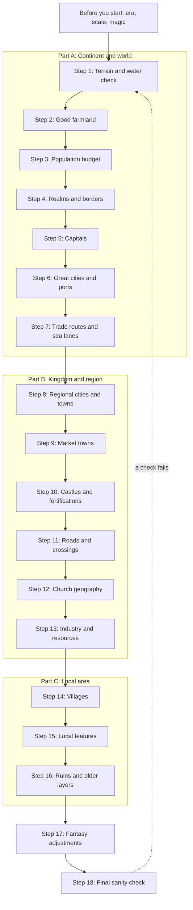

# Step by Step: From Blank Map to Living World

This chapter is the master method of the guide. It puts the other chapters in order and tells you what to place first, what comes next, and how to test each result. It assumes your terrain is already drawn: coasts, mountains, rivers, forests, marshes and climate. Every number below is copied from the chapter section linked in that step.

**In this chapter:**

- [Before you start](#before-you-start)
- [The order of work](#the-order-of-work)
- [Part A: Continent and world scale](#part-a-continent-and-world-scale)
- [Part B: Kingdom and region scale](#part-b-kingdom-and-region-scale)
- [Part C: Local area scale](#part-c-local-area-scale)
- [Finishing: fantasy and the final check](#finishing-fantasy-and-the-final-check)
- [Printable checklist](#printable-checklist)
- [Quick summary](#quick-summary)
- [Sources and further reading](#sources-and-further-reading)

---

## Before you start

> **Rule of thumb:** Make three decisions before you draw a single town: the date, the scale and the amount of magic. Each one changes the numbers you use.

| Decide | Options | What it changes |
|---|---|---|
| **Era** | c. 1300 (the crowded peak), 1350–1450 (after the plague), c. 1500 (recovery) or 1500–1650 (later era) | After the Black Death (1347–51), 30–60% of the people are gone, villages are deserted and towns are half-empty. After 1500, capitals, ports and forts grow. See [Change over time](02-population-and-sizes.md#change-over-time-growth-famine-and-plague). |
| **Scale** | Continent, kingdom or local area | What you draw: Part A, B or C below. See [What to show at each scale](06-villages-and-countryside.md#what-to-show-at-each-scale). |
| **Magic** | None, a little or a lot | Nothing at first. Use the real rules, then adjust in [Step 17](#step-17-make-the-fantasy-adjustments). |

If you draw only one kingdom, do Part A for that kingdom, then Parts B and C. If you draw only a local area, still decide where the nearest market town, castle and city are: they explain your villages.

> **Map tip:** Write the date in the title box ("The Kingdom of X, Year 1312") and draw a scale bar first. On a kingdom map at 1 cm = 10 km (about 1 inch = 16 mi), even a great city is only 2–4 mm across, so use symbols. Draw town outlines only on local maps.

---

## The order of work

> **Rule of thumb:** Work from big to small, and from nature to people: water and food first, then people, then power, then everything that serves them.

Each step says what to **place**, gives the key **rules** with numbers, links to the chapter section to **read**, and ends with a **check** question. If a check fails, fix it before you go on: an early mistake spreads into every later step.

> **Map tip:** Work in pencil or on separate layers (terrain, land quality, borders, settlements, routes, special sites), so you can switch one off while you check another.

---

## Part A: Continent and world scale

Here you decide where the people are, who rules them and how goods move. You do not place villages yet.

### Step 1: Check the terrain and water

**Place:** rivers, springs, marshes and fords; on each big river, the tidal limit (the highest point the tide reaches) and the head of navigation (the highest point boats can reach).

**Rules:**
- Mark which river stretches are **navigable** (deep enough for boats) and where they stop: falls, rapids or shallows. Draw them a little thicker.
- Where the lowest bridge, the old tidal limit and the highest point for sea ships come together is the best spot on your map for a big town.
- Rivers join as they flow downhill. They almost never split, except in deltas and marshes.
- Mark strong sites too: hills, river loops, islands and spurs (ridge ends with cliffs on two or three sides).

**Read:** [Placing settlements on your map: a method](01-settlement-placement.md#placing-settlements-on-your-map-a-method)

**Check:** Can you point to the head of navigation on every big river, and does no river split outside a delta or marsh?

### Step 2: Find the good farmland

**Place:** light shading for crowded lowland, ordinary farmland, thin hill country and empty land (mountain, marsh, forest, desert).

**Rules:**
- A person needs about 1 ha (2.5 acres) of ploughland, or 2–3 ha (5–7 acres) of all land once pasture, meadow and woodland are counted.
- A village needs arable (ploughed fields), meadow (hay), pasture and woodland, so the best land is where these meet: river valleys, plains and gentle hills.
- Good lowland holds 30–50 people per km² (80–130 per sq mi) at its peak; hills, uplands and mountains hold 2–10 (5–25 per sq mi).

**Read:** [Population density](02-population-and-sizes.md#population-density)

**Check:** Can you name the reason for every empty zone: mountain, marsh, heath, forest or desert?

### Step 3: Work out the population budget

**Place:** nothing yet. This step gives the numbers for every later step. Do it per region now, and add up each realm after Step 4.

**Rules:**
1. **Measure** each zone. A hex's area is about 0.866 × (width across the flat sides)²; a 30 km hex is about 780 km².
2. **Multiply by a density:** rich lowland 30–40 people per km², average land 15–25, hills 8–15, uplands, forest and marsh 2–5, desert 0. (Multiply by 2.59 for people per sq mi.)
3. **Split the total** by an urban profile:

| Per 1 million people | Frontier (Poland, Hungary, Scandinavia) | Average (England, France, Germany c. 1300) | Highly urban (Flanders, Lombardy, Tuscany) |
|---|---|---|---|
| Cities of 10,000+ | 0–1 | 1–2 | 5–10 |
| Towns of 2,000–10,000 | 8–12 | 12–18 | 30–40 |
| Small market towns | 40–60 | 60–90 | 80–100 |
| Villages | 3,000–4,500 | 2,500–3,500 | 2,000–2,500 |

4. **Compare** with real realms: a medium European kingdom c. 1300 had 1–5 million people, and a realm the size of England (130,000 km², 50,000 sq mi) should have 2–5 million. After the plague, use a third to a half fewer.

**Read:** [Step-by-step population calculator](02-population-and-sizes.md#step-by-step-population-calculator)

**Check:** Is each realm's total within the range of a real kingdom of the same size?

### Step 4: Draw realms and borders

**Place:** realm outlines, great fiefs (duchies and large counties) and frontier zones.

**Rules:**
- Use at least three kinds of state on a continent: one or two feudal kingdoms, one fragmented zone (city-states or a loose empire) and one unusual kind (a league of towns, a church state, a sea empire or nomads).
- A kingdom covers 10,000–450,000 km² (4,000–175,000 sq mi). Direct rule reaches roughly 500–700 km (300–450 mi) from the capital, 8–12 days for a messenger. Farther out, a realm needs viceroys, great vassals, sea routes or a relay post, or it splits.
- Borders are lines in settled farmland and wide bands in mountains, forests, marshes and war zones. Draw a march (a militarised border province) as hatching 10–50 km (6–30 mi) wide. Add an oddity or two: an enclave, a tiny buffer state, a disputed strip.

**Read:** [Borders and frontiers](03-capitals-and-borders.md#borders-and-frontiers); [How big can a realm be](03-capitals-and-borders.md#how-big-can-a-realm-be)

**Check:** Can you say what every border segment follows: a crest, a river, a forest, an old district line or a treaty?

### Step 5: Place the capitals

**Place:** one capital per realm, or a set of royal residences if the court travels.

**Rules:**
- A capital needs a rich core region, river or sea access, a defensible site, loyal land around it and legitimacy (an old royal or sacred site). Centrality matters less than you think: Paris, London and Kraków all lay off-centre, on navigable rivers.
- In a strong, centralised kingdom the capital holds about 1–2% of the realm's people and is 3–7 times the size of the second city. In a loose realm the largest city holds about 0.5% or less.
- Before about 1200 most western kings had no fixed capital: draw 5–15 royal residences about a day's travel apart instead.
- Around a fixed capital, draw 3–6 smaller residences within about 60 km (37 mi), a royal forest with a hunting lodge, a great abbey or burial church, and perhaps a coronation town 50–150 km (30–90 mi) away.

**Read:** [What makes a capital](03-capitals-and-borders.md#what-makes-a-capital); [Around the capital: the royal landscape](03-capitals-and-borders.md#around-the-capital-the-royal-landscape)

**Check:** Can you say why each capital is where it is, with a better reason than "it is in the middle"?

> **Later era (1500s+):** Fixed capitals win everywhere (Madrid from 1561). For a 1600-style map, draw the capital 2–4 times bigger than its medieval size. See [Population and bigger cities](09-later-era-1500-1650.md#population-and-bigger-cities).

### Step 6: Place the great cities and ports

**Place:** the few great cities of 50,000+ people and the main ports.

**Rules:**
- Around 1300, Europe, the Middle East and North Africa together had only about 22 cities of 50,000+ and 8 of 100,000+. Mark only 3–8 great cities on a continent map.
- A city of 50,000 must have river or sea supply. A city of 100,000 is only possible by water.
- The best sites are the lowest bridging point, the head of navigation, a confluence, an estuary or a superb harbour. On tidal coasts, big ports often sat 50–120 km (30–75 mi) up an estuary.
- A harbour needs shelter, deep water, fresh water and a river or road inland, and it must not silt up.

**Read:** [The biggest cities](02-population-and-sizes.md#the-biggest-cities); [What makes a good harbour](05-trade-routes-and-transport.md#what-makes-a-good-harbour)

**Check:** Is every great city on the sea or a navigable river, with a clear reason to be great (a court, a strait, a delta, an export trade)?

> **Fantasy twist:** A griffon carries about what a pack horse carries (100–120 kg), so flying mounts do not feed a great city. Only magic that moves bulk, such as a portal that passes shiploads of grain every day, frees big cities from the water rule. See [Teleport circles and portals](10-fantasy-variants.md#teleport-circles-and-portals).

### Step 7: Draw the trade routes and sea lanes

**Place:** sea lanes, river routes, main mountain passes and long land routes.

**Rules:**
- In England c. 1300, land : river : sea transport cost about 8 : 4 : 1. Bulk goods (grain, timber, stone, salt, wine) follow water, and travel more than 30–50 km (19–31 mi) over land only when they are valuable, or in war or famine.
- A continent usually has one or two bulk sea networks, several river spines and one or two long luxury routes over land. Copy a real one (the Hanse, Venice and Genoa, the Silk Roads) and join them at a few great ports.
- Sea lanes follow coasts and island chains. On a galley coast, put a watering port every 100–300 km (60–190 mi).
- Give each mountain range 1–3 main passes and 2–5 minor ones. Desert routes need water every 30–40 km (19–25 mi).

**Read:** [Real trade networks to copy](05-trade-routes-and-transport.md#real-trade-networks-to-copy); [Mountain passes](05-trade-routes-and-transport.md#mountain-passes)

**Check:** For each region, can you write "exports ..., imports ..." and trace each export to water or a market?

> **Map tip:** A continent map shows realms and great fiefs, 3–8 great cities, sea lanes with their sailing seasons, main passes, great shrines, universities, mining districts in 3–6 mountain areas, and only the greatest fortresses (about 1 per 20,000–50,000 km², 8,000–19,000 sq mi). Leave counties, villages and ordinary castles for the kingdom map.

---

## Part B: Kingdom and region scale

Now zoom in to one realm and place the towns that serve it, the castles that hold it and the routes, churches and industries that tie it together.

### Step 8: Place regional cities and towns

**Place:** counties and their seats, cities, and towns of 2,000–10,000 people.

**Rules:**
- Divide the realm into 4–8 duchies or great fiefs, then into counties 50–70 km (30–45 mi) across, each with a seat near its middle. An England-sized kingdom has 30–40 counties.
- Put towns at confluences, heads of navigation, gaps in hill ranges, the feet of passes, harbours and crossings of main roads.
- Cities of 10,000+ stand 60–90 km (37–56 mi) apart in very urban regions, 130–170 km (80–105 mi) in average ones and 260–400 km (160–250 mi) in thinly urban ones. For each, expect about 10 towns and 50–100 market towns.
- A town of 10,000 needs farmland within 21–27 km (13–17 mi) on good land. Draw that circle faintly; if two circles overlap heavily, shrink one town or put it on water.

**Read:** [How far apart: the numbers](01-settlement-placement.md#how-far-apart-the-numbers); [Political units and their sizes](03-capitals-and-borders.md#political-units-and-their-sizes)

**Check:** Can you write a "site" note (the ground it stands on) and a "situation" note (its place among routes and regions) for every town?

### Step 9: Fill in the market towns

**Place:** small market towns of 500–2,000 people, each with a weekly market and a yearly fair.

**Rules:**
- Space them about 9–16 km (6–10 mi) apart, so a peasant can walk to market and home in one day (6–10 km, 4–6 mi, each way). In thinly settled land they can be up to about 25 km (15 mi) apart.
- Put them on rivers and road junctions. Two market towns 3 km (2 mi) apart compete; make one a village.
- Christaller's central places form neat hexagons only on a flat, even plain. Stretch the pattern along rivers and roads, and squeeze it on rich land.

**Read:** [Central place theory, made simple](01-settlement-placement.md#central-place-theory-made-simple)

**Check:** Can every village reach a market town and get home the same day?

### Step 10: Place castles and fortifications

**Place:** castles, town walls, watchtowers and beacon chains.

**Rules:**
- Every fortification controls something. Write its job in one word (*road*, *bridge*, *town*, *border*, *estate*, *refuge* or *watch*); the job gives the site.
- Peaceful core: a working castle every 20–30 km (12–19 mi). Contested border: one every 4–6 km (2.5–4 mi). Conquest chain: one every day's march, 20–40 km (12–25 mi), each reachable by water.

| Zone, per 1,000 km² (about 390 sq mi), c. 1300 | All castle sites ever built | Active castles |
|---|---|---|
| Peaceful lowland core | 4–8 | 1–3 |
| England and Wales average | ~12 | ~4 |
| March or contested border | 35–60 | 12–20 |

- Put the castle at the edge of its town, on the high point or by the river, with the market at its gate. Wall cities, regional capitals, frontier towns and raided ports; leave most market towns open.
- Peacetime garrisons are only 5–20 men. Beacons stand about 5–20 km (3–12 mi) apart in hilly country.

**Read:** [How many castles and how far apart](04-military-sites.md#how-many-castles-and-how-far-apart); [How many to draw](04-military-sites.md#how-many-to-draw)

**Check:** Can you name what each castle controls, and is the map sparse in the core and dense on the border?

> **Later era (1500s+):** Low, thick star forts with angled bastions spread beyond Italy in the 1530s–1540s. They were so expensive that only frontiers, capitals, main ports and key river crossings get them. See [Gunpowder and the new fortifications](09-later-era-1500-1650.md#gunpowder-and-the-new-fortifications).

### Step 11: Draw roads and crossings

**Place:** bridges, fords, ferries, roads, inns, hospices and tolls.

**Rules:**
- Crossings first: roads bend to reach them and towns grow at them. A great river gets only a few fixed bridges, often tens of km apart, with ferries and fords between.
- Main roads link cities through the crossings and passes, along valleys and dry ridges. Only an older empire's roads run straight. Local tracks link villages to their market town like the spokes of a wheel.
- Put an inn or village every 15–30 km (10–19 mi) on main roads, a caravanserai (walled roadside inn) every 30–40 km (19–25 mi) in desert, and a hospice at each main pass. Tolls sit at bridges, gates, gorges, straits and borders.
- Walkers cover 25–35 km (15–22 mi) a day, ox carts 15–25 km (10–15 mi) and armies with baggage 13–20 km (8–12 mi).

**Read:** [Drawing the route network](05-trade-routes-and-transport.md#drawing-the-route-network)

**Check:** For each road, can you say where it goes, what it carries and why it bends where it does?

> **Later era (1500s+):** Post stations every 20–40 km (12–25 mi) carry letters up to about 150 km (95 mi) a day, and canals with pound locks begin to climb hills. See [Posts, roads and canals](09-later-era-1500-1650.md#posts-roads-and-canals).

### Step 12: Lay out the church geography

**Place:** cathedrals, abbeys, friaries, shrines and pilgrim roads, hospitals and universities.

**Rules:**
- **Dioceses** (one bishop's area): in an English-style realm, one per 5,000–10,000 km² (2,000–4,000 sq mi), so a cathedral means a main city. In an Italian-style land, one per 500–2,000 km² (190–770 sq mi), many in small towns.
- **Monasteries:** about 1 religious house per 150 km² (60 sq mi). Cistercians in empty, well-watered valleys; canons at town edges; friars inside towns of about 3,000–5,000 and up. Give big abbeys granges (outlying farms), most within about 25 km (15 mi).
- **Friaries measure towns:** none at 2,000–3,000 people, about 2 at 10,000, 4 at 20,000–40,000.
- **Pilgrim roads** follow existing roads, with stops about 20 km (12 mi) apart and a hospice at every pass.
- **Charity and learning:** a hospital in every market town; a leper house 1–2 km (about 1 mi) outside each town of 2,000+; one or two universities in a kingdom of 2–5 million.

**Read:** [Monasteries, friaries and military orders](08-religious-cultural-and-ancient-sites.md#monasteries-friaries-and-military-orders); [Drawing it all: symbols, density and scale](08-religious-cultural-and-ancient-sites.md#drawing-it-all-symbols-density-and-scale)

**Check:** Is every Cistercian abbey in an empty valley, and every friary in a town big enough to feed it?

### Step 13: Place industry and resource sites

**Place:** mines, salt works, quarries, cloth districts, fisheries and fair towns.

**Rules:**
- Industry goes to its heaviest input: the ore, the fuel or the water power, not the customer. Check three things for each site: the resource, the fuel and the way out (a river, a coast or a road to one).
- Per kingdom, aim for 1–3 mining districts, 1–3 salt sources, one cloth region, one or two fair towns and several ports. Every realm needs salt, or a route that brings it in.
- A mining district holds 2–7 mining towns 10–40 km (6–25 mi) apart, up side valleys, plus a mint town. Most had 1,000–5,000 people; rare boom towns of 10,000–20,000 could ignore the water rule, because silver pays for carted food.
- Ironworks need charcoal and fast streams: draw many small forges along the streams, not one big town.

**Read:** [The basic rules: what pulls industry to a place](07-industry-and-resources.md#the-basic-rules-what-pulls-industry-to-a-place); [Special town types and how to spot them](07-industry-and-resources.md#special-town-types-and-how-to-spot-them)

**Check:** For every industry, can you point to the resource, the fuel and the way out?

> **Map tip:** A kingdom map shows the capital, the cities, all the towns and the main market towns, with villages only as texture in the plains. Add county borders, royal and county castles, the border chain, cathedrals, great abbeys, shrines and mining districts. Leave mills, hamlets and gallows for the local map.

---

## Part C: Local area scale

A local map covers one or two parishes up to a small county, roughly 5 × 5 km to 50 × 50 km (3 × 3 to 30 × 30 mi). Here almost every square kilometre has a human feature.

### Step 14: Place the villages

**Place:** villages, hamlets and farmsteads, each village with its parish church.

**Rules:**
- Open-field land gives tight (nucleated) villages. Hills, forest and marsh give hamlets and lone farms. A road, valley stream or dyke gives villages in a line.
- Lowland villages stand 1.5–4 km (1–2.5 mi) apart: on terraces above the floods, along spring lines and on the edge between two kinds of land. In hills, parish churches stand 8–15 km (5–9 mi) apart, with hamlets between.
- A typical village has 30–60 households (150–300 people), with fields within about 2 km (1.3 mi). Land use forms rings: gardens, then arable, then pasture, then wood and waste at the parish edge. Meadow follows the streams.

**Read:** [Sizes, territory and walking distances](06-villages-and-countryside.md#sizes-territory-and-walking-distances)

**Check:** Does every village touch water and have its fields within about 2 km (1.3 mi)?

> **Fantasy twist:** Where monsters roam at night, move people into fewer, walled villages of 300–1,000, with fields within 4–5 km (2.5–3 mi) of the walls. See [Dangerous wilderness and monsters](10-fantasy-variants.md#dangerous-wilderness-and-monsters).

### Step 15: Add the local features

**Place:** mills, manor houses, parks and forests, meeting places, gallows and boundaries.

**Rules:**
- About one mill per village: watermills on streams with a weir and a leat (a channel to the wheel); windmills on high ground in flat, dry country.
- The manor house stands beside the church, often moated, with a dovecote and fishponds.
- A royal forest is a legal hunting area: draw a dotted boundary with villages and fields inside, not solid trees. Deer parks are rounded enclosures 0.5–1 km (0.3–0.6 mi) across.
- Hundreds (districts within a county) about 12–15 km (7–9 mi) across meet at a mound, stone or ford. A gallows stands on a hill by the main road outside each town.

| On a 20 × 20 km (12 × 12 mi) lowland map, England c. 1300 | Number |
|---|---|
| Villages with parish churches | ~25–30 |
| Mills | ~30–45 |
| Moated sites | ~15–20 |
| Deer parks | ~10 |
| Market places (many tiny) | ~5 |

**Read:** [Drawing a local-area map](06-villages-and-countryside.md#drawing-a-local-area-map)

**Check:** Does every patch of land have a use, and is any empty space labelled as marsh, moor or forest?

### Step 16: Add ruins and older layers

**Place:** old roads, hillforts, castle ruins, deserted villages and moved towns.

**Rules:**
- Show what was already old at your map's date. Ruins near living towns are quarried away; they survive in empty country.
- Draw a few long, straight "old roads" linking cities, with later towns along them, and in hilly country 1–3 hillforts per 100 km² (39 sq mi), with barrows along the ridges.
- In long-settled land, draw one or two castle ruins or earthworks for every active castle; on a new frontier, almost none.
- England has more than 3,000 known deserted villages, at least 1,500 abandoned c. 1350–1520. Draw them as a lone church in a field.

**Read:** [Ancient and ruined layers](08-religious-cultural-and-ancient-sites.md#ancient-and-ruined-layers); [How settlements change over time](01-settlement-placement.md#how-settlements-change-over-time)

**Check:** Is there at least one older layer, and is every feature possible by the date in your title box?

> **Map tip:** Use three styles: working features, old features still in use (like an ancient road), and ruins in grey or dashed lines. For the fine detail of Steps 14–16, follow the [method for a local map](06-villages-and-countryside.md#a-method-for-a-local-map) in chapter 06.

---

## Finishing: fantasy and the final check

### Step 17: Make the fantasy adjustments

**Place:** the places that magic, monsters and other peoples create, and the places they destroy.

**Rules:**
- Real rules first. Then ask which input each fantasy element changes (water, food, defence, travel cost, threats or resources), and write one line: "X exists, so Y changes."
- Add magic in this order: magical resources (a crystal is ore; a ley line is a river); the towers, academies and boom towns that use them; density changes; new hubs such as portals and aeries; then the fortresses.
- Danger concentrates people: walled hilltop villages, refuge forts about a day's walk (24–32 km, 15–20 mi) apart, and a frontier band of 30–100 km (20–60 mi) between the safe core and the wild.
- Strong fertility magic (about twice the yield) gives density like Flanders: 50–75 people per km² (130–190 per sq mi).
- Magic can give a town its reason to exist, but not its water and food. Use no more than three or four fantasy elements per region.

**Read:** [The method: change the inputs, not the rules](10-fantasy-variants.md#the-method-change-the-inputs-not-the-rules); [Consistency checklist](10-fantasy-variants.md#consistency-checklist)

**Check:** Does every magical city still show where its water and food come from?

> **Later era (1500s+):** For a 1500–1650 map, keep the villages and market towns. Grow the capital and the ocean ports, turn interior castles into ruins or palaces, and add star forts only where they pay, post roads, a canal or a drained polder, and a religious border with ruined abbeys on the Protestant side. See [Drawing a world in transition](09-later-era-1500-1650.md#drawing-a-world-in-transition).

### Step 18: Run the final sanity check

**Place:** nothing new. Fix what fails.

**Rules:**
- Run the "why is it here?" test on every dot. A village needs water, a mix of land nearby and safety from floods. A town must also stand where routes meet. A city must also be on navigable water or the coast and be the best-connected place in a rich region.
- Count symbols: far more villages than towns, far more towns than cities.
- Every empty area needs a reason; every crowded area needs good land.
- Place labels last, biggest first, with 2–3 typefaces at most.

**Read:** [The "why is it here?" test](01-settlement-placement.md#the-why-is-it-here-test); [Sanity check: 20 questions for a finished map](11-common-mistakes.md#sanity-check-20-questions-for-a-finished-map)

**Check:** Can you answer "yes" to all 20 sanity-check questions?

> **Map tip:** Keep a short list beside your map: name, rank, site type and a one-line situation ("Kingsford: town; ford and confluence; where the north road meets the Silverwater"). It takes a few minutes and catches most mistakes.

---

## Printable checklist

**Before you start**
- [ ] Date in the title box, scale bar drawn, amount of magic decided

**Part A: Continent and world**
- [ ] 1. Navigable stretches, heads of navigation, fords and tidal limits marked
- [ ] 2. Land shaded by quality; every empty zone has a reason
- [ ] 3. Population = area × density, checked against real kingdoms
- [ ] 4. At least three kinds of state; every border follows something
- [ ] 5. Capitals in rich, defensible cores on navigable water
- [ ] 6. Only 3–8 great cities, all on the sea or a navigable river
- [ ] 7. Sea lanes, river spines and passes drawn; exports and imports noted

**Part B: Kingdom and region**
- [ ] 8. Counties 50–70 km (30–45 mi) across; towns at route nodes
- [ ] 9. Market towns about 9–16 km (6–10 mi) apart
- [ ] 10. Every castle has a one-word job; sparse core, dense border
- [ ] 11. Few bridges on big rivers; inns every 15–30 km (10–19 mi)
- [ ] 12. Dioceses, monasteries, friaries, shrines and hospitals placed
- [ ] 13. Every industry has a resource, fuel and a way out; every realm has salt

**Part C: Local area**
- [ ] 14. Villages 1.5–4 km (1–2.5 mi) apart in lowland, each on water
- [ ] 15. Mills, manors, parks, meeting places and gallows added
- [ ] 16. Ruins and older layers added; nothing too new for the date

**Finishing**
- [ ] 17. Each fantasy element has an "X exists, so Y changes" line
- [ ] 18. "Why is it here?" test and the 20 sanity questions passed; labels placed last

---

## Quick summary

- Decide the era, the scale and the amount of magic first, then write the date on the map and draw a scale bar.
- Work from big to small and from nature to people: water, farmland, population, realms, capitals, great cities and routes; then towns, castles, roads, churches and industry; then villages, local features and ruins.
- Population is area × density. Good lowland holds 30–50 people per km² (80–130 per sq mi).
- Capitals sit in rich, defensible cores on navigable water. Great cities of 50,000+ are rare and always fed by river or sea.
- Bulk goods follow water (land : river : sea ≈ 8 : 4 : 1). Roads bend to crossings and passes, with a stop every 15–30 km (10–19 mi).
- Spacing: villages 1.5–4 km (1–2.5 mi), market towns 9–16 km (6–10 mi), and cities of 10,000+ from 60–90 km (37–56 mi) apart in very urban regions to 260–400 km (160–250 mi) in thinly urban ones.
- Every castle controls something: a working castle every 20–30 km (12–19 mi) in a peaceful core, one every 4–6 km (2.5–4 mi) on a contested border.
- Churches form a carpet, monasteries a scatter (about 1 per 150 km², 60 sq mi), and cathedrals and universities a handful.
- Industry sits on its heaviest input, and every realm needs salt.
- Add ruins and older layers, then the fantasy changes, then run the "why is it here?" test and the 20 sanity questions.

---

## Sources and further reading

This chapter is a summary and adds no new research. Every number comes from the chapter section linked in each step. The sources are listed at the end of each chapter, from [Where Settlements Are Built (and Why)](01-settlement-placement.md#sources-and-further-reading) to [Common Mistakes and How to Fix Them](11-common-mistakes.md#sources-and-further-reading), and the shared figures are in [research/baseline-numbers.md](../research/baseline-numbers.md).
