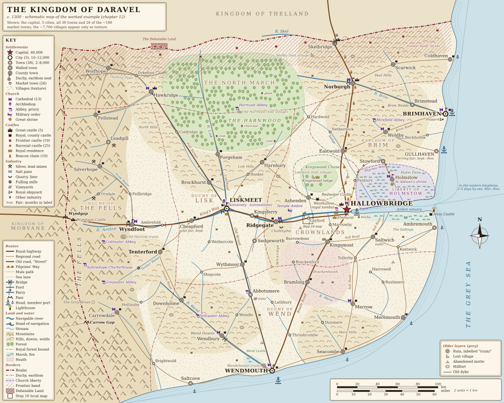

# Worked Example: Populating a Kingdom

This chapter builds one invented kingdom from an empty terrain map to a full kingdom map and one local map, and then redraws it at four dates. It uses the guide's own numbers, shows every calculation in a table, and links each number to the chapter that owns it. Treat it as a template: put in your own areas and land types and redo the arithmetic. The kingdom, its places and its history are invented; the real examples quoted come from the other chapters and from the sources at the end.

**In this chapter:**

- [The kingdom at a glance](#the-kingdom-at-a-glance)
- [Step 1: Land and population](#step-1-land-and-population)
- [Step 2: Cities, towns and villages](#step-2-cities-towns-and-villages)
- [Step 3: The capital](#step-3-the-capital)
- [Step 4: Duchies, counties and the North March](#step-4-duchies-counties-and-the-north-march)
- [Step 5: Castles and fortifications](#step-5-castles-and-fortifications)
- [Step 6: Roads, rivers and the sea](#step-6-roads-rivers-and-the-sea)
- [Step 7: The Church](#step-7-the-church)
- [Step 8: Industry and special towns](#step-8-industry-and-special-towns)
- [Step 9: Ruins and older layers](#step-9-ruins-and-older-layers)
- [Step 10: Zoom in on the Leyford area](#step-10-zoom-in-on-the-leyford-area)
- [Step 11: A fantasy variant](#step-11-a-fantasy-variant)
- [Step 12: The same kingdom at four dates](#step-12-the-same-kingdom-at-four-dates)
- [Quick summary](#quick-summary)
- [Sources and further reading](#sources-and-further-reading)

The general method is in [Step by Step](00-step-by-step.md). The coordinates of every place, road, river and border are in [worked-example-layout.json](images/worked-example-layout.json) (canvas 1000 × 800 units, 2 units = 1 km).

*Daravel c. 1300, drawn from the layout file with the symbols of the [master legend](13-quick-reference.md#master-legend-and-label-hierarchy). It shows the capital, the 3 cities, all 38 towns and 26 of the ~180 market towns; the ~7,700 villages appear only as texture. Also shown: the 13 cathedrals, the White Keep, the 31 county castles, the 13 other royal and frontier castles, 25 baronial castles, the 9 ports (4 head ports), the 4 bridges on the Ambre and the beacon chain. The master legend has no pass symbol and gives ")(" to bridges, so the two passes take a small saddle mark.*

---

## The kingdom at a glance

> **Rule of thumb:** Draw the terrain first and decide the date. Every number below depends on the land and on the year.

**Daravel** is a centralised feudal kingdom in the year **1300**, the crowded peak before the Great Famine and the Black Death (see [Change over time](02-population-and-sizes.md#change-over-time-growth-famine-and-plague)).

| Feature | Daravel |
|---|---|
| Area | About 116,500 km² (45,000 sq mi): about 390 km (240 mi) east to west and 380 km (235 mi) north to south. England is 130,000 km². |
| Coast | East and south, on the Grey Sea |
| Estuary | The Ambre estuary, 83 km (52 mi) from the open sea to its head |
| Main river | The Ambre, navigable for river boats 158 km (98 mi) above the estuary; the Lisk joins it at Liskmeet |
| Mountains | The Fells along the whole west border. The crest is the border. One cart pass (the Wyndgap) and one mule path (the Carrow Gap). |
| Forest | The Harnwood, about 11,000 km² in the north |
| Marsh | The Holm Fens north of the estuary, the Saltings salt marsh south of it, the Wend Levels |
| Other land | The Whitridge (a limestone ridge cut by the Ambre), Brackenheath (sandy heath), the Wend Downs and Brim Wolds (chalk and limestone hills) |
| Neighbours | Thelland to the north (hostile), Morvane to the west across the Fells (at peace) |

> **Map tip:** Before any dot goes down, mark the navigable stretch of each river, the tidal limit, the fords, the pass and the land types. This is step 1 of the method in [Where Settlements Are Built](01-settlement-placement.md#placing-settlements-on-your-map-a-method).

---

## Step 1: Land and population

**Method:** measure each land type, multiply by a density from [Population density](02-population-and-sizes.md#by-type-of-land), and add up ([calculator, steps 1–3](02-population-and-sizes.md#step-by-step-population-calculator)).

| Land type | Area | Density used (range) | People |
|---|---|---|---|
| Fertile lowland (Ambre vale, coastal plains) | 44,500 km² (17,200 sq mi) | 35 per km² (30–40) | 1,557,500 |
| Mixed farmland and rolling hills (downs, wolds, foothills) | 33,500 km² (12,900 sq mi) | 20 (15–25) | 670,000 |
| Heath and poor sandy land | 3,000 km² (1,200 sq mi) | 10 (7–15) | 30,000 |
| Uplands and mountains (the Fells) | 20,500 km² (7,900 sq mi) | 5 (2–10) | 102,500 |
| Forest (Harnwood, Kingswood) | 11,500 km² (4,400 sq mi) | 4 (1–5) | 46,000 |
| Marsh and fen | 3,500 km² (1,400 sq mi) | 5 (2–5) | 17,500 |
| **Total** | **116,500 km² (45,000 sq mi)** | **~21 per km² (54 per sq mi)** | **~2.4 million (range 1.9–2.9 million)** |

**Checks:**

- A realm the size of England should have 2–5 million people ([Realm populations](02-population-and-sizes.md#realm-populations-and-areas)). Daravel, at 2.4 million, is less crowded than England in 1290 (~36 per km²) and close to the European average of about 20 per km² c. 1300. ✔
- **Food:** at about 1 ha (2.5 acres) of ploughland per person, Daravel needs about 24,000 km² of arable, under a third of its 78,000 km² of lowland and mixed land. At 2–3 ha (5–7 acres) of all land per person it needs 48,500–73,000 km² ([Carrying capacity](02-population-and-sizes.md#carrying-capacity-how-much-land-feeds-people)). It has room to grow. ✔

> **Map tip:** Shade the map lightly in these six land types before you place anything. The shading is your population map: crowded vale, ordinary hills, thin Fells, nearly empty forest and fen.

---

## Step 2: Cities, towns and villages

**Method:** choose an urban profile and split the people into tiers, then divide by a typical size ([calculator, steps 4–5](02-population-and-sizes.md#step-by-step-population-calculator)). Daravel uses the **average** profile (England, France and Germany c. 1300).

| Tier | Share | People | Typical size | Number of places |
|---|---|---|---|---|
| Cities of 10,000+ | ~3% | ~73,000 | sized by rank (below) | 4 |
| Towns of 2,000–10,000 | ~5% | ~121,000 | ÷ 3,000–4,000 | 30–40 → **38** |
| Small market towns | ~6% | ~145,000 | ÷ ~800 | **~180** |
| Villages, hamlets, farms | ~86% | ~2,084,000 | ÷ 250 (lowland) or 100–150 (hills) | **~7,700 villages** |

Quick-ratio check for an average realm, per million people: 1–2 cities, 12–18 towns, 60–90 market towns, 2,500–3,500 villages. For 2.4 million that is 2–5, 29–44, 145–220 and 6,000–8,500. Daravel fits every row. ✔

### The top of the ladder

The capital of a strong kingdom holds about 1–2% of its people and is 3–7 times bigger than the second city ([Rank-size rule](02-population-and-sizes.md#the-rank-size-rule-and-primate-cities)). The rank-size rule predicts the 2nd place at ½ of the largest, the 3rd at ⅓, and so on.

| Rank | Place | People | Rank-size prediction | Why it is here |
|---|---|---|---|---|
| 1 | **Hallowbridge** (capital) | 40,000 (1.65% of the realm) | — | Lowest bridge on the Ambre, at the tidal limit |
| 2 | Liskmeet | 12,000 | 20,000 | Confluence; old imperial city |
| 3 | Wendmouth | 11,000 | 13,300 | River-mouth harbour |
| 4 | Brimhaven | 10,000 | 10,000 | Wool port |
| 5 | Tenterford | 8,000 | 8,000 | Cloth town on a fast hill stream |
| 6 | Ridgegate | 7,000 | 6,700 | Gap town; second bridge |
| 7 | Norburgh | 6,500 | 5,700 | March fortress and muster town |
| 8 | Wyndfoot | 5,000 | 5,000 | Pass town below the Wyndgap |
| 9 | Holmstow | 4,500 | 4,400 | Shrine on a fen island |
| 10–13 | Saltwich 4,000 (brine), Hawkridge 4,000 (march fortress), Cheapford 3,800 (ford, head of navigation), Silverhope 3,500 (silver) | | | |

Hallowbridge is 3.3 times Liskmeet: a primate capital, like London c. 1377 at 3–4 times York. Below it the rule fits closely. ✔

**The other 29 towns** (2,000–3,600 each, 74,700 people in all):

| Region | Towns |
|---|---|
| Crownlands | Kingsmoat 3,000; Ashenden 2,800; Ambremouth 2,400 |
| Duchy of Lisk | Forgeham 2,800; Brockhurst 2,700; Wythmoor 2,600; Harnbury 2,500; Sedgeworth 2,400; Kingsferry 2,200 |
| Duchy of the Fells | Carrowdale 2,400; Leadgill 2,200; Fellstead 2,000 |
| North March | Skelbridge 2,800; Coldhaven 2,200; Scarwick 2,100; Wolfhope 2,000 |
| Earldom of Brim | Woldby 3,300; Gullhaven 3,000; Eastwold 2,800; Stowford 2,500; Brimstead 2,300 |
| Duchy of Wend | Wendbury 3,600; Merrow 3,100; Meremouth 2,800; Abbotsmere 2,800; Downholme 2,700; Bramling 2,400; Seacombe 2,300; Saltcove 2,000 |

### Villages

Rural people per zone are the zone's total minus the townspeople living there. Village sizes follow [step 5 of the calculator](02-population-and-sizes.md#step-by-step-population-calculator); spacing uses the hexagon rule from [How far apart](01-settlement-placement.md#how-far-apart-the-numbers) (each place "owns" 0.87 × spacing²).

| Zone | Rural people | Share in villages | Typical village | Villages | Land per village | Spacing |
|---|---|---|---|---|---|---|
| Fertile lowland | ~1,300,000 | 90% | 250 | ~4,700 | ~9.5 km² | ~3.3 km (2 mi) |
| Mixed farmland | ~613,000 | 75% | 200 | ~2,300 | ~14.6 km² | ~4.1 km (2.5 mi) |
| Heath | ~29,000 | 70% | 150 | ~140 | ~21 km² | ~4.9 km (3 mi) |
| Fells | ~85,000 | 50% | 125 | ~340 | ~60 km² | ~8.3 km (5 mi) |
| Forest | ~44,000 | 50% | 125 | ~180 | ~64 km² | ~8.6 km (5 mi) |
| Marsh | ~13,000 | 60% | 125 | ~60 | ~58 km² | ~8 km (5 mi) |
| **Total** | **~2,084,000** | **~83%** | | **~7,700** | | |

The other ~355,000 country people live in hamlets (10–75 people) and farmsteads (5–15), mostly in the Fells, the forest and the fen edge.

**Spacing checks** ([Patterns and spacing](01-settlement-placement.md#patterns-and-spacing)):

- Lowland villages ~3.3 km apart (rule: 1.5–4 km, 1–2.5 mi); Fell parishes ~60 km² (rule: 50–100+ km²). ✔
- 222 market centres (market towns, towns and cities) give one per ~525 km², about 25 km (15 mi) apart. Add 100–200 villages with a weekly market, as in chapter 02's mini-example, and markets in the vale are 14–16 km (9–10 mi) apart: a 6–10 km walk at most. ✔
- The 8 places of 5,000+ are about 130 km (80 mi) apart, like Britain; the 4 cities about 180 km (115 mi), between France and Britain. ✔
- All four cities are on navigable water or the coast. Inland Tenterford stays under 10,000 ([the "why is it here?" test](01-settlement-placement.md#the-why-is-it-here-test)). ✔

> **Later era (1500s+):** By 1600 draw the capital 2–4 times bigger (80,000–160,000) with suburbs far outside its walls, and grow Brimhaven or Wendmouth fastest if ocean trade arrives ([Population and bigger cities](09-later-era-1500-1650.md#population-and-bigger-cities)).

> **Map tip:** On the kingdom map, draw the capital, the 3 cities, all 38 towns and only 30–40 of the ~180 market towns (the schematic map at the top shows 26, to keep its labels readable). Show villages as texture in the vale, not as 7,700 dots.

---

## Step 3: The capital

**Hallowbridge** stands at the lowest bridging point of the Ambre, at the tidal limit, 83 km (52 mi) up the estuary. On tidal coasts big ports sat 50–120 km (30–75 mi) inland ([Notes on site types](01-settlement-placement.md#notes-on-the-most-important-types)). It meets all five needs from [What makes a capital](03-capitals-and-borders.md#what-makes-a-capital):

| Need | Hallowbridge |
|---|---|
| Rich core region | The lower Ambre vale: about 10,000 km² of lowland in the Crownlands (the royal domain) |
| River or sea access | Sea ships to its quays; river boats 158 km (98 mi) up the Ambre. A city of 40,000 needs an overland hinterland of roughly 40–55 km (25–35 mi), so water supply is essential ([Feeding towns](02-population-and-sizes.md#feeding-towns-the-hinterland)). |
| Defensible core | The White Keep on a low bluff on the north bank, with the river in front |
| Loyalty | The Crownlands are the dynasty's home lands |
| Legitimacy | Royal burial abbey at Westhallow; coronation in the old city of Liskmeet |

It is **not central** ([Common mistakes, no. 12](11-common-mistakes.md#12-the-capital-at-the-exact-centre)). The far north-west corner is 322 km (200 mi) away in a straight line, about 350–400 km by road: 4–8 days for a royal messenger, a normal kingdom ([How big can a realm be](03-capitals-and-borders.md#distance-from-the-capital-and-what-it-means)).

**The royal landscape** ([Around the capital](03-capitals-and-borders.md#around-the-capital-the-royal-landscape)):

| Feature | Place | Distance | Rule |
|---|---|---|---|
| Palace quarter and royal burial abbey | Westhallow | 4 km (2.5 mi) upstream | Like Westminster, ~3 km from London; burial church 0–20 km |
| Royal residences | Elmhurst manor, Redwater Castle, Kingsmoat castle, Kingswood lodge | 14, 31, 37 and 43 km (9, 19, 23, 27 mi) | 3–6 residences within ~60 km |
| Royal forest | Kingswood Chase | 30–55 km (19–34 mi) | 10–100 km |
| Coronation city | Liskmeet cathedral | 119 km (74 mi) | 50–150 km; Reims is ~130 km from Paris |

> **Map tip:** Draw Hallowbridge as two linked parts: the walled merchant city with the White Keep at its upstream corner, and the palace and abbey of Westhallow a little upstream. Put the port quays below the bridge, never above it ([Bridges](05-trade-routes-and-transport.md#crossing-rivers-bridges-fords-and-ferries)).

---

## Step 4: Duchies, counties and the North March

**Method:** divide the realm into 4–8 great fiefs, then into counties of 50–70 km (30–45 mi) across, each with a seat near its middle, and add 1–3 special zones ([Political units](03-capitals-and-borders.md#political-units-and-their-sizes)). People below come from each region's land types × the densities of step 1.

| Region | Area | People | Counties | Seat | Character |
|---|---|---|---|---|---|
| Crownlands (royal domain) | 14,000 km² (5,400 sq mi) | ~400,000 | 5 | Hallowbridge | Lower Ambre vale |
| Duchy of Lisk | 17,600 km² (6,800 sq mi) | ~420,000 | 6 | Liskmeet | Middle Ambre, Lisk valley, south Harnwood |
| Duchy of Wend | 24,100 km² (9,300 sq mi) | ~650,000 | 7 | Wendmouth | South coast, downs, heath |
| Earldom of Brim | 9,400 km² (3,600 sq mi) | ~240,000 | 3 | Brimhaven | Wolds and north-east coast; small but rich |
| Duchy of the Fells | 25,100 km² (9,700 sq mi) | ~330,000 | 5 | Wyndfoot | Mountains, pass, mines, cloth valley |
| North March | 23,900 km² (9,200 sq mi) | ~365,000 | 6 | Norburgh | Frontier facing Thelland |
| Liberty of Holmstow | 2,600 km² (1,000 sq mi) | ~15,000 | 1 | Holmstow | The abbot's church territory in the fens |
| **Kingdom** | **116,500 km² (45,000 sq mi)** | **~2.4 million** | **33** | | |

**Checks:** duchies of 9,400–25,100 km² (rule: 10,000–50,000; Flanders was ~10,000 km²). 33 counties of ~3,500 km² (1,370 sq mi), about 59 km (37 mi) across, with ~73,000 people each (England: ~3,300 km² and ~120,000; the guide suggests 30–40 counties for an England-sized realm). ✔ The North March has ~15 people per km² against 27–29 in the Crownlands and Wend: emptier, as a march should be ([Marches](03-capitals-and-borders.md#marches-militarised-border-provinces)).

**Smaller units:** about 750 hundreds (district courts) of ~155 km², each with 10–11 parishes and an open-air moot site ([Local administration](06-villages-and-countryside.md#local-administration-parish-manor-hundred)); 150–200 baronies, each with a castle at its head manor (*caput*); one to three manors per village.

**Borders** ([Borders and frontiers](03-capitals-and-borders.md#borders-and-frontiers)):

- **West:** the crest of the Fells, with paired castles 17 km (11 mi) apart on either side of the Wyndgap pass.
- **North:** hill crests and the Harnwood in the west, the River Skel in the east, with a hatched **frontier band 30 km (19 mi) deep** (the guide's band is 10–50 km).
- **Oddities:** the **Debatable Land**, a disputed strip 16 × 6 km (10 × 4 mi), and the Liberty of Holmstow.
- **Inside:** duchy borders follow the Whitridge, the foothills, the fen and forest edges, never straight lines ([Common mistakes, no. 13](11-common-mistakes.md#13-straight-borders-without-a-reason)).

> **Map tip:** Draw the realm border as a thick dash-dot line and duchy borders as medium dash-dot lines; leave county borders off at kingdom scale. Borders are always dash-dot lines, so no one mistakes them for roads ([master legend](13-quick-reference.md#master-legend-and-label-hierarchy)). Mark each seat with a small pennant and each county town with a dot in the middle of its town symbol. Label the North March and the Debatable Land by name, fill the Debatable Land with stripes in the two claimants' colours, and give the Liberty its own colour.

---

## Step 5: Castles and fortifications

**Method:** apply the densities per 1,000 km² from [How many to draw](04-military-sites.md#how-many-to-draw) zone by zone. About one-third of all castle sites are in use at once.

| Zone | Area | Rate used | Sites ever built | Active c. 1300 | Gap between active castles |
|---|---|---|---|---|---|
| Peaceful core (Crownlands, Lisk, Wend, Brim, Liberty) | 68,000 km² | 6 sites, 2 active per 1,000 km² (rule: 4–8 and 1–3) | ~410 | ~135 | ~24 km (15 mi) |
| Duchy of the Fells (mostly mountain) | 25,100 km² | 4 sites, 1 active (low end of the core rule) | ~100 | ~25 | ~34 km (21 mi) |
| North March | 23,900 km² | One site per 110–130 km², like the Anglo-Scottish border | ~200 | ~65 | ~20 km (12 mi) |
| **Total** | 116,500 km² | | **~710** | **~225** | |

Core castles 20–30 km (12–19 mi) apart match the guide's peaceful core ([Borderlands](04-military-sites.md#borderlands-and-conquered-land)). Daravel has ~1.9 active castles per 1,000 km² against ~4 in England and Wales: fewer people, and no Welsh-style march of tiny lordships. A gaming rule of one castle per 50,000 people would give only ~48 ([Gaming rules](02-population-and-sizes.md#gaming-rules-of-thumb-vs-history)).

**What the ~225 active castles are** ([Types of fortification](04-military-sites.md#types-of-fortification)):

| Type | Number | Where and why (its one-word job) |
|---|---|---|
| Royal citadel: great stone tower and curtain wall | 1 | White Keep, Hallowbridge: *town*, *bridge*, royal armoury |
| County-town castles: stone keeps, shell keeps on old mottes, curtain walls | 31 | One at the edge of every county town except the capital and Holmstow. Norburgh, Hawkridge and Skelbridge are rebuilt as concentric castles. |
| Pass fortress (concentric) | 1 | Wyndgap Castle: *pass* |
| Forward line on the north border | 10 | Small castles and towers at fords and passes, 29–43 km (18–27 mi) apart, about a day's march |
| Estuary castle | 1 | Ness Castle at the estuary mouth: *harbour* |
| Royal residence castle | 1 | Redwater Castle |
| Baronial castles and fortified manor houses | ~180 | At the head manors of baronies: *estate* |

- **Garrisons:** 5–20 men per ordinary castle, 30–60 at the 14 frontier castles: 1,500–5,000 men in peace, about 0.1–0.2% of the people ([Garrisons and armies](04-military-sites.md#garrisons-and-armies)).
- **Field army:** 0.2–0.5% of 2.4 million = **5,000–12,000** soldiers; an all-out 1% (~24,000) lasts only weeks.
- **Behind the front:** muster towns at Norburgh and Wyndfoot, the armoury in the White Keep, the fleet at Brimhaven ([Military geography](04-military-sites.md#military-geography-and-logistics)).
- **Walls:** stone walls only at the capital, the cities, Ridgegate, Norburgh, Hawkridge, Skelbridge and Wyndfoot; a ditch and gates at Tenterford and Saltwich; the rest open ([Common mistakes, no. 25](11-common-mistakes.md#25-every-town-walled)).
- **Beacons:** 10 beacons about 16 km (10 mi) apart from Skelbridge to the capital (rule: 5–20 km): warning within the hour, against 2–3½ days for a rider ([Beacons](04-military-sites.md#watchtowers-beacons-and-coastal-warning)).
- **Ruins:** the other ~485 sites are abandoned mottes and ringworks.

> **Later era (1500s+):** Put bastioned star forts at Skelbridge and Norburgh, a citadel at Hallowbridge and low gun forts at the estuary mouth. Turn most inland castles into ruins, palaces or manor houses ([Gunpowder and the new fortifications](09-later-era-1500-1650.md#gunpowder-and-the-new-fortifications)).

> **Map tip:** On the kingdom map draw the White Keep, the 31 county castles, the 13 other royal and frontier castles, about one major baronial castle per 2,000–3,000 km² (about 25) and a few grey ruined mottes. Give the five great fortresses (the White Keep, Wyndgap and the three concentric castles) the large three-tower icon and every other castle the small one-tower icon; draw each beacon as a flame dot and each abandoned motte as a grey mound with a tower tick. Leave the other ~155 baronial castles for local maps.

---

## Step 6: Roads, rivers and the sea

**Water first** ([Rivers as roads](05-trade-routes-and-transport.md#rivers-as-roads)):

| Waterway | Stretch | Length | Traffic |
|---|---|---|---|
| Ambre estuary | Mouth to Hallowbridge | 83 km (52 mi) | Sea ships (cogs) |
| Ambre | Hallowbridge – Ridgegate – Liskmeet – Cheapford | 158 km (98 mi) | River boats; towpaths; Cheapford is the head of navigation |
| Lisk | Liskmeet to Forgeham | ~65 km (40 mi) | River boats carrying iron and timber |
| Brim | Brimhaven to Norburgh | ~100 km (60 mi) | Small boats: they supply the march fortress |
| Wend | Wendmouth to Wendbury | ~60 km (37 mi) | Small boats |

**Main roads** (royal highways; [Roads](05-trade-routes-and-transport.md#roads)):

| Road | Route | Length |
|---|---|---|
| The King's Way | Hallowbridge – Leyford – Ridgegate – Liskmeet – Cheapford – Wyndfoot – Wyndgap pass | 285 km (177 mi) |
| The North Road | Hallowbridge – Eastwold – Norburgh – Skelbridge | 170 km (106 mi) |
| The South Road | Hallowbridge – Kingsmoat – Bramling – Wendmouth | 173 km (107 mi) |
| Old Street (an old imperial road) | Liskmeet – Wythmoor – Abbotsmere – Wendmouth, dead straight | 167 km (104 mi) |
| The Brim Road | Eastwold – Woldby – Brimhaven | 109 km (68 mi) |

About 900 km of royal highway needs an inn every 15–30 km (10–19 mi): **30–60 stopping places**, most in existing towns and villages ([Inns](05-trade-routes-and-transport.md#inns-hospices-and-caravanserais)). Regional roads (Downs Road, Fells Road, Harn Road, Salt Roads, Pilgrims' Way) link every market town to its neighbours.

- **Crossings:** the Ambre has only 4 fixed bridges: Hallowbridge, Ridgegate (71 km upstream), Liskmeet (51 km further) and Wyndfoot (95 km further). Between them: fords at Cheapford and Ambrefold, ferries at Kingsferry and Thornwick ([Crossing rivers](05-trade-routes-and-transport.md#crossing-rivers-bridges-fords-and-ferries)).
- **Passes:** the Wyndgap is a low cart pass with a hospice near the summit, a toll, a castle and a chain of villages down to Wyndfoot. The Carrow Gap is a summer mule path with no towns ([Mountain passes](05-trade-routes-and-transport.md#mountain-passes)).
- **Tolls:** pontage and port customs at Hallowbridge; bridge tolls at Ridgegate and Liskmeet; the Wyndgap; the Skel bridge into Thelland ([Tolls](05-trade-routes-and-transport.md#tolls-and-customs)).
- **Ports:** about 600 km (370 mi) of open coast needs 4–6 head ports at one per 100–150 km. Daravel has 4 head ports (the customs ports): Hallowbridge (below the bridge), Brimhaven (royal shipyard), Wendmouth and Gullhaven (herring). Its 5 member ports are Ambremouth (outport, pilots and the only lighthouse), Meremouth, Coldhaven, Seacombe and Saltcove. Sea lanes hug the coast; one open-sea crossing runs east, sailed from March to November only, as in the North Sea ([The sea](05-trade-routes-and-transport.md#the-sea-ships-harbours-and-sea-lanes); [Sailing seasons](05-trade-routes-and-transport.md#sailing-seasons)).

**Travel times** at the guide's [speeds per day](05-trade-routes-and-transport.md#speed-per-day): walker 25–35 km, ox cart 15–25 km, royal messenger 50–90 km, river boat 40–100 km downstream and 10–20 km upstream, sailing ship 40–100 km.

| From Hallowbridge to | Distance | On foot | Ox cart | Messenger | By water |
|---|---|---|---|---|---|
| Ridgegate | 70 km (44 mi) | 2–3 days | 3–5 days | 1 day | Upstream 3½–7 days |
| Liskmeet | 120 km (75 mi) | 3½–5 days | 5–8 days | 1½–2½ days | Upstream 6–12 days; back downstream 1½–3 days |
| Norburgh | 127 km (79 mi) | 4–5 days | 5–9 days | 1½–2½ days | — |
| Brimhaven | 167 km (104 mi) road; 182 km (113 mi) sea | 5–7 days | 7–11 days | 2–3½ days | Sailing ship 2–5 days |
| Skelbridge (border) | 170 km (106 mi) | 5–7 days | 7–11 days | 2–3½ days | — |
| Wendmouth | 173 km (107 mi) road; 373 km (232 mi) sea | 5–7 days | 7–12 days | 2–3½ days | Sailing ship 4–9 days |
| Wyndfoot | 218 km (135 mi) | 6–9 days | 9–15 days | 2½–4½ days | — |
| Wyndgap pass | 285 km (177 mi) | 8–11 days | 11–19 days | 3–6 days | — |

An army with baggage (13–20 km a day) needs 9–13 days to reach the Skel bridge, so the North March must hold out alone for about two weeks.

> **Map tip:** Draw the navigable Ambre thicker up to Cheapford, with a small boat at the head of navigation. Draw the 4 bridges as ")(" with the road running through, each ford as a short dashed line across the river and each ferry as a short dotted line with an "F" ([Symbols and labels](05-trade-routes-and-transport.md#symbols-and-labels)). Draw head ports as a large anchor with a quay and write their names in capitals; member ports get a small anchor. Sea lanes and the mule path are dotted lines; the season goes in the label ("2–5 days by sea, Mar.–Nov."). Write the travel days on the long roads ("Norburgh 4 days"). Every road must end somewhere: a town, a port, a pass, a mine or a shrine ([Drawing the route network](05-trade-routes-and-transport.md#drawing-the-route-network)).

---

## Step 7: The Church

**Method:** use the English densities and rules in [Religious, Cultural, Legal and Ancient Sites](08-religious-cultural-and-ancient-sites.md#the-religious-map-at-a-glance).

| Feature | Daravel | Rule from chapter 08 |
|---|---|---|
| Parish churches | ~8,000 (7,700 villages plus ~300 in towns and cities; one per ~14.5 km², 5.6 sq mi) | ~73 per 1,000 km² would give ~8,500 |
| Dioceses (cathedrals) | 13, about 9,000 km² (3,500 sq mi) each | English style: one per 5,000–10,000 km² |
| Archbishop | 1, at Liskmeet: the oldest city, not the capital | Oldest or richest city |
| University | 1, at Liskmeet | 1–2 for a kingdom of 2–5 million, in the capital or oldest cathedral city |
| Religious houses | ~730 (one per ~160 km²) | about 1 per 150 km² |
| Hospitals open c. 1300 | ~280: one per market town, 2–5 per walled town | Gates, bridges, main roads |
| Leper houses | ~50: one outside each town of 2,000+, one on each main road out of the capital and cities | 1–2 km outside the gate |

**Cathedral cities:** Liskmeet (archbishop), Hallowbridge, Wendmouth, Brimhaven, Ridgegate, Norburgh, Wyndfoot, Holmstow (a monastic cathedral, like Ely), Hawkridge, Wendbury, Merrow, Carrowdale and Woldby. In an English-style realm a cathedral marks an important place: 9 of the 13 are cities or towns of 4,000+, and the other 4 are county towns of 2,400–3,600 ([Dioceses](08-religious-cultural-and-ancient-sites.md#dioceses-cathedrals-and-archbishops)).

**Religious houses by order** (England's numbers scaled to Daravel's area; [Monasteries](08-religious-cultural-and-ancient-sites.md#monasteries-friaries-and-military-orders)):

| Order | Number | Where |
|---|---|---|
| Benedictine and Cluniac monks | ~165 | Old towns: Westhallow (royal), Holmstow (shrine), Abbotsmere (monastery town) |
| Cistercian monks | ~60 | Empty, watered valleys: Harnvale, Greywater, Coldwater, Stillwater, Mirefield |
| Carthusians | 1 | Sallowhope, deep in the Fells. England had only two charterhouses by 1300 (Witham 1178, Hinton 1227). |
| Augustinian and other canons | ~270 | Town edges, hospitals, castles |
| Nunneries | ~130 | Quiet rural sites |
| Friaries | ~75 | In towns: 6 in the capital, 3 per city, 2 per large town, 1–2 in most county towns |
| Military-order commanderies | ~25 | One farm estate per inland county |

Each big abbey has 5–40 granges (outlying farms), most within about 25 km (15 mi).

**The pilgrimage:** the shrine of the invented national saint, St Aldwen, is at **Holmstow Abbey** on its fen island. The Pilgrims' Way runs 87 km (54 mi) from the capital to the pilgrim town of Stowford, then by causeway or boat to the shrine: 4–5 stages of about 20 km (12 mi), with a hospice at Stowford and a leper house on the last stretch ([Pilgrimage](08-religious-cultural-and-ancient-sites.md#pilgrimage-shrines-routes-and-hostels)).

> **Map tip:** At kingdom scale, show only the 13 cathedrals (a church front with two towers; a double cross beside Liskmeet for the archbishop), the great abbeys (a church with a square cloister beside it), Temple Ambre (a small church with a shield), the shrine (a scallop shell, never a star) and the university. A small crown beside Liskmeet labelled "(coronations)" and beside Westhallow labelled "(royal tombs)" marks the two royal churches. Save the 8,000 parish churches and the friaries for local and town maps.

---

## Step 8: Industry and special towns

**Method:** for every industry, find the resource, the fuel and the way out ([The basic rules](07-industry-and-resources.md#the-basic-rules-what-pulls-industry-to-a-place)). The guide suggests 1–3 mining districts, 1–3 salt sources, one cloth region, one or two fair towns and several ports per kingdom ([Special town types](07-industry-and-resources.md#special-town-types-and-how-to-spot-them)).

| Industry | Resource, fuel and way out | Special place (people) |
|---|---|---|
| Silver and lead ([Mining](07-industry-and-resources.md#mining-and-metals)) | Veins, wood and fast streams in the Fells; road down to Wyndfoot | Silverhope with the royal mint (3,500), Leadgill (2,200), Orsdale (~900), 25–28 km (16–17 mi) apart; mining towns usually have 1,000–5,000 |
| Brine salt ([Salt](07-industry-and-resources.md#salt)) | Brine springs; fuel by water (timber, fen peat); three Salt Roads, one to an estuary landing 26 km (16 mi) away | Saltwich (4,000) |
| Sea salt | Salterns boiling sea water on the Saltings; small output, as in the north | Marsh-edge hamlets |
| Stone and lime ([Stone](07-industry-and-resources.md#stone-clay-and-lime)) | Whitridge limestone right beside the Ambre | Chalkhythe quarries and kilns |
| Iron, charcoal, glass ([Forest industries](07-industry-and-resources.md#forest-industries)) | Ore, coppice and streams of the Harnwood; iron goes down the Lisk | Forgeham (2,800), forge ponds, a glasshouse |
| Wool and cloth ([Textiles](07-industry-and-resources.md#textiles)) | Sheep on the Fells, downs and wolds; fulling mills on the Tenter Water | Tenterford (8,000), Cheapford wool fair in September (3,800), Brimhaven wool exports |
| Fish ([Fishing](07-industry-and-resources.md#fishing)) | Autumn herring; Saltwich salt | Gullhaven herring fair, late September to November (3,000); fishing hamlets a few km apart |
| Ships, wine, brick | Harnwood oak via the Brim; south slopes; estuary clay | Royal shipyard at Brimhaven; monastic vineyards at Abbotsmere; brickfields at Hallowbridge |

Every region still grows its own grain first; the mining towns buy food from the vale through Wyndfoot ([Common mistakes, no. 26](11-common-mistakes.md#26-single-product-economies)).

The fair dates copy real ones. Stourbridge Fair near Cambridge, one of the biggest English fairs, was held around Holy Cross Day (14 September), after the harvest. The free herring fair at Great Yarmouth began at Michaelmas (29 September) and lasted about 40 days, the main herring season on that coast ([Fishing](07-industry-and-resources.md#fishing)).

> **Map tip:** Give each special place a visible reason: crossed hammers at Silverhope, salt pans (a small checkerboard) on the Saltings and at Saltwich, a quarry notch at Chalkhythe, a mill wheel on the Tenter Water, an anchor with a castle tower for the royal shipyard at Brimhaven. A fair gets no symbol of its own: write the months in the town's label ("Cheapford, wool fair, Sept."). Label the three roads out of Saltwich "Salt Road".

---

## Step 9: Ruins and older layers

> **Rule of thumb:** Every medieval landscape stands on older ones. Old things survive far from towns; near towns their stone is carted away ([Ancient and ruined layers](08-religious-cultural-and-ancient-sites.md#ancient-and-ruined-layers)).

| Layer | In Daravel | Real model |
|---|---|---|
| Older empire's roads | Old Street and Fell Street: straight, still used | Watling Street |
| Old towns and forts | Liskmeet and Hawkridge stand on old imperial sites; **Wendchester** is a walled ruin in the fields about 10 km (6 mi) from Wendmouth | Wroxeter, 8 km from Shrewsbury ([Reuse](01-settlement-placement.md#reuse-of-ancient-and-roman-sites)) |
| Hillforts | Hundreds; show 6. **Old Harrow** above Wyndfoot has a ruined church: the bishop moved down to the river town. | Old Sarum and Salisbury |
| Barrows and stones | Barrows on the Wend Downs ridge; the Grey Wives stone circle in the Fells | Avebury |
| Old border | The Thelling Dyke, 25 km (16 mi) inside today's border | Offa's Dyke |
| Abandoned castles | ~485 mottes and ringworks; show about 10 | |
| Deserted villages | Few in 1300: Old Harnvale (cleared by Cistercians), Lostwick (royal forest), Skelby (burnt in raids) | Most came after 1350 ([Deserted villages](01-settlement-placement.md#deserted-medieval-villages)) |

> **Map tip:** Draw ruins in grey with their own symbol and label them "(ruin)": Wendchester is a grey walled-town symbol, Old Harrow a grey church inside hillfort rings. A deserted village is a grey church alone in a field, labelled "(lost village)". Keep dotted lines for paths and draw the Thelling Dyke as a grey line with short ticks for the bank. If you redate the map to 1450, add dozens of "lost village" symbols in the clay vale, shrink the towns inside their walls and turn hill fields back into pasture ([Step 12](#step-12-the-same-kingdom-at-four-dates)).

---

## Step 10: Zoom in on the Leyford area

The local map covers 10 × 10 km (6 × 6 mi), 100 km² (39 sq mi), of rich vale on the south bank of the Ambre, 38 km (24 mi) west of the capital on the King's Way. At 35 people per km² it should hold about 3,500 people. It is centred on the market town of **Leyford**, where the King's Way crosses the Ley Brook.

**Features** compared with the English averages per 100 km² in [How many features](06-villages-and-countryside.md#how-many-features-england-c-1300-averages):

| Feature | Leyford area | English average per 100 km² |
|---|---|---|
| Market town | 1 (Leyford) | 1–2 market places |
| Villages with a parish church | 9, plus Leyford's church | ~7 (this is the richest part of the vale) |
| Hamlets | 5 | 0–5 in open-field lowland |
| Mills | 11 (10 watermills, 1 windmill) | ~8–11 |
| Manors | 9 lay manors and 1 monastic grange; 5 of them moated | ~4–5 moated sites |
| Deer parks | 2 (about 1.1 km and 0.8 km across) | ~2–3 |
| Fishponds | 2 groups (6 ponds) | at least 1–2 |
| Hundred meeting place | 1 (Ley Low, a mound by the King's Way) | ~0.5–0.7 |
| Other | Hospital, gallows, 2 wayside crosses, a rabbit warren | — |

**Households** (4.5–5 people each; [Village territory](06-villages-and-countryside.md#sizes-territory-and-walking-distances)):

| Place | Households | People |
|---|---|---|
| Leyford (market town: market cross, 2 inns, hospital, bridge) | 160 | 720–800 |
| Stanmere (moated hall, dovecote, fishponds, park) | 75 | 340–375 |
| Thornwick (two manors, Ambre ferry) | 70 | 315–350 |
| Kettlebury, Hollowell, Ashlade (each with a moated manor) | 60, 55, 50 | 740–825 |
| Crossby (windmill), Oxlade (grange nearby) | 50, 45 | 425–475 |
| Upper Ley, Brackenhurst (heath-edge commons) | 40, 35 | 340–375 |
| 5 hamlets (Mill End, Fennick End, Heathcot, Woodside, Coldhams) | 40 | 180–200 |
| Millers, warrener, park keepers, grange lay brothers | 12 | 55–60 |
| **Total** | **692** | **~3,100–3,450 (31–35 per km²)** |

**How it is laid out:**

- **Spacing:** villages 1.5–3.4 km (1–2 mi) apart (rule: 1.5–4 km), all on terraces above the flood plain, each church beside its manor house ([Village forms](06-villages-and-countryside.md#village-forms-and-layouts)). The farthest, Brackenhurst, is 5.5 km (3.4 mi) from Leyford market.
- **Rings** ([Rings of land use](06-villages-and-countryside.md#rings-of-land-use-around-a-village)): tofts and crofts by the houses; two or three open fields within 1.1–1.7 km (0.7–1 mi); meadow on the Ambre flood plain and along the brooks; four coppice woods at the parish edges; Ley Heath (common pasture and warren) on the sandy south.
- **Mills:** three brooks run north into the Ambre; the Ley's four mills are 1.6–2.8 km apart; the navigable Ambre has no mill weir; Crossby, with no stream, has the windmill ([Mills](06-villages-and-countryside.md#mills-and-water-management)).
- **Roads:** the King's Way, cleared 200 ft (61 m) each side under the Statute of Winchester; lanes from every village to Leyford like spokes; drove tracks to the heath; a lane to the Thornwick ferry.

> **Map tip:** At this scale every square kilometre has an owner and a name. Draw parish boundaries as thin dash-dot-dot lines along brooks and wood edges, put a mill on every village's stream, and keep empty white space only for the heath, which you label.

---

## Step 11: A fantasy variant

Apply the real rules first, then change one input and follow the chain ([The method](10-fantasy-variants.md#the-method-change-the-inputs-not-the-rules)). Here are two changes.

**A. Monsters in the Harnwood** ([Dangerous wilderness](10-fantasy-variants.md#dangerous-wilderness-and-monsters)):

| Feature | Realistic Daravel | With monsters |
|---|---|---|
| Forest people | ~46,000 in ~180 open villages and many hamlets | Perhaps half stay (an estimate), packed into 25–75 walled villages of 300–1,000 at the forest edge; the interior is empty |
| Refuges | None needed | Refuge forts a day's walk (24–32 km, 15–20 mi) apart round the forest's ~390 km (240 mi) edge: about 12–16 forts |
| Forest roads | The Lisk Road (154 km) and Fell Street | Cleared about 60 m (200 ft) each side, fortified stops every 15–30 km, patrols |
| Rangers | — | Lodges at the forest edge, fords and road entries, 15–30 km (10–20 mi) apart |
| Iron and glass | Forgeham smelts with Harnwood charcoal | Charcoal burners need guards; iron costs more or is imported |

**B. Dwarves under the Fells** ([Dwarves](10-fantasy-variants.md#dwarves-mountain-holds-and-gate-towns)):

- A hold of about 10,000 under Silverhope would need farmland within about 55 km (35 mi) on marginal land. The Fells cannot supply it, so the hold buys food.
- At 200–250 kg of grain per person a year that is 2,000–2,500 tonnes: 17,000–25,000 pack-horse loads of 100–120 kg, or 45–70 loads a day.
- Grain comes by boat to Cheapford, the head of navigation, then 90 km (56 mi) by road to a **gate town** at Fellbridge on the valley floor, which grows from a market town into a main Fells town. Metal and coin flow back down.
- A dwarven tunnel under the Wyndgap is a pass with no snow season ([Mountain passes](05-trade-routes-and-transport.md#mountain-passes)): it takes the traffic and the toll. Real tunnels were short (8–9 km between two Cappadocian underground towns), so draw one, not a network.

> **Fantasy twist:** Change only these two inputs. The vale, rivers, capital, counties and 7,700 villages stay where the real rules put them, and that contrast makes the fantasy parts feel real.

> **Map tip:** Draw the haunted Harnwood as a second hatched frontier band with refuge-fort symbols along its edge. Draw Fellbridge with a road climbing to a gate in the mountainside, and mark the tunnel mouths on both sides of the Wyndgap.

---

## Step 12: The same kingdom at four dates

> **Rule of thumb:** A new date changes the numbers, not the geography. Rivers, passes, bridges, the capital's site and most village sites stay where they are. The number of people, towns, markets, fields, woods and working castles changes, and some places become ruins.

**Why:** Each kind of place follows the population, but at its own speed ([Change over time](02-population-and-sizes.md#change-over-time-growth-famine-and-plague)):

- **Villages come first and last longest.** Most lowland villages already existed by 1100 (Domesday Book, 1086, names 13,418 places), so growth mostly made them bigger. New villages appeared mainly in forest, fen, heath and upland.
- **Markets, towns, castles and abbeys multiply** in the 1100s and 1200s. In Kent, market places grew from under 20 in 1200 to more than 80 by 1350, if every charter became a working market (McLain 1997). England's religious houses grew from 61 in 1066 to about 400 by 1154 (Webber 2006).
- **After the Black Death** towns shrink inside their walls, the worst fields go back to grass or scrub, and villages on poor land are given up, mostly in the 1400s.
- **After 1500** most of the new growth goes to the capital and the ports ([What changes after 1500](09-later-era-1500-1650.md#what-changes-and-what-stays-the-same)).

**The scaling factors.** England is the best-measured realm, so use its curve unless you have a reason not to:

| England | 1086 | 1290–1300 | 1400 | 1450 | 1600 |
|---|---|---|---|---|---|
| People | 1.71 million | 4.75 million (1290) | 2.08 million | 1.90 million | ~4.1 million |
| Share of the 1290 peak | 36% | 100% | 44% | 40% | ~86% |
| Arable land, fallow included | — | 11.5 million acres (1300) | 8.7 million acres (1380) | 7.6 million acres | 8.9 million acres |
| Woodland and wood-pasture | ~15% | ~7% (c. 1349) | stopped falling; scrub on abandoned land | — | — |

Sources: people from Broadberry, Campbell and van Leeuwen (2011, Table 6), with 1600 from [chapter 09](09-later-era-1500-1650.md#how-many-people); arable land from Broadberry and others (2010, Table 1); woodland from Rackham's Domesday estimate and a Royal Forestry Society summary ([How much of the map is fields and woods](06-villages-and-countryside.md#how-much-of-the-map-is-fields-and-woods)).

England fell further than most of Europe. Europe as a whole went from about 70–80 million in 1300 to about 50–60 million by 1400–1450, a loss of a quarter to a third ([Realm populations](02-population-and-sizes.md#realm-populations-and-areas)). So for 1400, an England-like Daravel keeps about 1.05 million people and a Daravel with the European average keeps 1.6–1.8 million. The table uses about 1.2 million.

### Daravel at four dates

The 1300 column is the kingdom of steps 1–11. The other columns are estimates made with the factors above; treat every number as a range.

| Tier or feature | 1100 | 1300 | 1400 | 1600 |
|---|---|---|---|---|
| People | ~1.0 million (0.9–1.4 million) | ~2.4 million | ~1.2 million (1.0–1.8 million) | ~2.4 million (2.0–2.8 million) |
| Density | ~9 per km² (22 per sq mi) | ~21 (54) | ~10 (27) | ~21 (54) |
| Capital (Hallowbridge) | 10,000–15,000 (1–1.5% of the realm) | 40,000 | 20,000–25,000 (about half, like London between c. 1300 and 1377) | 80,000–160,000 (2–4 times its medieval size) |
| Other cities of 10,000+ | 0–1 (Liskmeet, the old imperial city) | 3 | 0–1 | 2–4, the ports first |
| Towns of 2,000–10,000 | 10–15 | 38 | 10–15 (most small towns drop below 2,000) | 30–40 |
| Market centres (market towns, towns and cities) | 50–80 | ~222, plus 100–200 village markets | ~200; most village markets lapse | 130–160 market places in all |
| Villages | 6,000–6,500, most of them smaller (100–150 people) | ~7,700 | 7,000–7,500, many half empty; 10–25% gone by 1500 | 6,000–7,000 |
| Ploughland, fallow included | ~10,000 km² (~9%) | ~24,000 km² (~21%) | 16,000–18,000 km² (a quarter to a third less) | 18,000–21,000 km² (less fallow, better yields) |
| Woods | 15–20% | ~10% | ~11–12%: scrub and birch on abandoned edges | ~10% |
| Castles in use | 300–400, almost all earth and timber | ~225; the important ones stone | 150–200, plus tower houses in the North March | the royal fortresses, 2–3 star forts, gun forts at the estuary; most others are ruins or houses |
| Religious houses | ~100, almost all Benedictine | ~730 (75 friaries) | ~700 | ~730 if the realm stays Catholic; none working if it turns Protestant |

**How the counts were made:**

- **People:** 1300 × England's share of the peak (1100: about 40%), or the European loss for 1400. Density is people ÷ 116,500 km².
- **Capital:** the guide's rule that a strong kingdom's capital holds 1–2% of its people ([Rank-size rule](02-population-and-sizes.md#the-rank-size-rule-and-primate-cities)); in 1100 the court still travels, so take the low end. London fell from 60,000–100,000 c. 1300 to about 35,000 in 1377.
- **Villages:** in 1100, about 90% of the vale villages, 80% of the hill villages and a third of the villages in the Fells, forest, fen and heath (~720 in 1300). For 1500, Germany lost about 23.5% of its settlements between 1300 and 1500 (about 170,000 down to 130,000), and England has more than 3,000 known deserted villages ([Deserted villages](01-settlement-placement.md#deserted-medieval-villages)).
- **Towns:** in England the towns of 1377 were only half to two-thirds of their pre-plague size, and about 30 towns of 2,000–10,000 remained for 2.5 million people ([The settlement ladder](02-population-and-sizes.md#the-settlement-ladder)). At that rate Daravel's 3 cities fall into the town tier, and all but one of its 29 small towns (2,000–3,600 people) fall below 2,000. The 1100 count is an estimate in proportion to the people and the markets.
- **Markets in 1100:** about a fifth of the 1300 number, following Kent's growth from under 20 market places in 1200 to more than 80 by 1350.
- **Markets in 1600:** only about 39% of the market places of c. 1300 still worked c. 1600 in England. 39% of Daravel's 320–420 market places is about 130–160.
- **Ploughland:** about 1 ha (2.5 acres) per person at the peak; after the plague, England's arable fell by a quarter (1380) to a third (1450).
- **Castles and abbeys:** see [Types of fortification](04-military-sites.md#types-of-fortification), [Timeline of the changes](09-later-era-1500-1650.md#timeline-of-the-changes) and [the dissolution of the monasteries](09-later-era-1500-1650.md#religion-the-reformation-on-the-map). The 1100, 1400 and 1600 castle counts are estimates.

### What to redraw at each date

| Date | Add | Remove, shrink or turn grey |
|---|---|---|
| **1100** | An earth-and-timber motte at most county towns and at many manors; old Benedictine abbeys; a bigger Harnwood and more woods in the clay vale; a travelling court with several royal residences ([What exists by which date](13-quick-reference.md#what-exists-by-which-date)) | Two-thirds or more of the market towns and towns; all friaries (they arrive in the 1220s) and the Cistercian valley abbeys; stone county castles (only the White Keep stands in stone); the Tenter Water fulling mills (first recorded in England in 1185); most villages in the Fells, fen and heath |
| **1300** | Everything in steps 1–11: farms high up the valley sides, suburbs outside the gates | Only the older layers of step 9 |
| **1400** | Grey "(lost village)" churches on poor land (a few dozen now, hundreds by 1500); sheep pasture on old ploughland; scrub at the forest edges; gardens and empty plots inside the walls; tower houses and fortified manors in the North March | Most village markets; some small towns drop to market-town size; castles no longer kept up turn grey |
| **1600** | A capital 2–4 times bigger with suburbs far outside the walls; star forts at Skelbridge and Norburgh, a citadel at Hallowbridge, gun forts at the estuary mouth; a post station every 20–40 km (12–25 mi) on the royal highways (about 23–45 on 900 km); country houses in parks | Most inland castles (ruins, palaces or manor houses); if Protestant, the abbeys become grey ruins labelled "(ruin)" or houses called "Abbey", St Aldwen's shrine is destroyed and the Pilgrims' Way empties; more than half the market places of 1300 |

> **Later era (1500s+):** The 1600 column is the medieval map with a new top layer, not a new map. Villages, market spacing and walking distances stay the same; the capital, the ports, the forts and the post roads change ([What changes and what stays the same](09-later-era-1500-1650.md#what-changes-and-what-stays-the-same)).

> **Map tip:** Keep one base map with the terrain, rivers, roads and village dots. Draw each date as a separate overlay, and change the symbols, not the coastline: smaller or fewer town symbols in 1100 and 1400, grey ruins and lost villages from 1400, star forts and post horns in 1600. Put the date in the title cartouche, because a reader cannot judge the map without it.

---

## Quick summary

- **Land × density:** 116,500 km² (45,000 sq mi) gives about 2.4 million people (1.9–2.9 million), ~21 per km² (54 per sq mi).
- **Average urban profile:** 4 cities, 38 towns, ~180 market towns and ~7,700 villages, 3.3 km (2 mi) apart in the vale.
- **Primate capital:** Hallowbridge, 40,000 (1.65% of the realm, 3.3 times the second city), at the lowest bridge, 83 km (52 mi) up the estuary.
- **Royal landscape:** palace and burial abbey 4 km (2.5 mi) away, 4 more residences within 43 km (27 mi), a royal forest, coronation 119 km (74 mi) away in the archbishop's city.
- **Politics:** 6 great fiefs plus the Crownlands, 33 counties of ~3,500 km² (1,370 sq mi), ~750 hundreds, a march with a 30 km (19 mi) frontier band, a Debatable Land, a church liberty.
- **Castles:** ~710 sites, ~225 in use: 20–30 km (12–19 mi) apart in the core, a forward line every 29–43 km (18–27 mi), a beacon chain, a field army of 5,000–12,000.
- **Routes:** water first; ~900 km of royal highway with an inn every 15–30 km; 4 bridges on the Ambre; one cart pass; Liskmeet is 3½–5 days' walk from the capital.
- **Church:** ~8,000 parishes, 13 dioceses, ~730 religious houses (~75 friaries), 1 university, 1 great shrine.
- **Industry:** one mining district, two salt sources, one cloth region, two fairs (months in the label), a quarry, an iron forest and 9 ports (4 head ports), each with a visible reason.
- **Older layers and fantasy:** add old roads, grey ruins, lost villages and abandoned mottes; then change one or two fantasy inputs and follow the consequences.
- **Four dates:** about 1.0 million people in 1100, 2.4 million in 1300, 1.2 million in 1400 and 2.4 million again in 1600. Keep the geography; change the counts, the ploughland, the woods, the castles and the ruins.
- **Symbols:** use the [master legend](13-quick-reference.md#master-legend-and-label-hierarchy): a filled star for the capital, dash-dot lines for borders, solid or dotted lines for routes, ")(" for bridges, grey for ruins.

---

## Sources and further reading

All numbers come from the chapters of this guide and the shared baseline ([research/baseline-numbers.md](../research/baseline-numbers.md)). Their full source lists are in chapters [01](01-settlement-placement.md#sources-and-further-reading) to [11](11-common-mistakes.md#sources-and-further-reading). The works below are the ones this example leans on most.

**Books and articles**

- Beresford, Maurice, and H. P. R. Finberg (1973). *English Medieval Boroughs: A Handlist*. Newton Abbot: David & Charles.
- Bosker, Maarten, Eltjo Buringh and Jan Luiten van Zanden (2013). "From Baghdad to London: Unraveling Urban Development in Europe, the Middle East, and North Africa, 800–1800." *Review of Economics and Statistics* 95(4): 1418–1437.
- Broadberry, Stephen, Bruce M. S. Campbell, Alexander Klein, Mark Overton and Bas van Leeuwen (2010). "English Economic Growth, 1270–1700." CAGE Working Paper 21, University of Warwick. (Table 1: English arable land, 1270–1700.)
- Broadberry, Stephen, Bruce M. S. Campbell, Alexander Klein, Mark Overton and Bas van Leeuwen (2015). *British Economic Growth, 1270–1870*. Cambridge: Cambridge University Press.
- Broadberry, Stephen, Bruce M. S. Campbell and Bas van Leeuwen (2011). "English Medieval Population: Reconciling Time Series and Cross Sectional Evidence." Working paper, University of Warwick. (Table 6: English population, 1086–1541.)
- Christaller, Walter (1933). *Die zentralen Orte in Süddeutschland*. Jena: Gustav Fischer.
- Creighton, Oliver (2002). *Castles and Landscapes: Power, Community and Fortification in Medieval England*. London: Continuum.
- Dyer, Christopher (2002). *Making a Living in the Middle Ages: The People of Britain 850–1520*. New Haven: Yale University Press.
- Holder, Nick (2017). *The Friaries of Medieval London: From Foundation to Dissolution*. Woodbridge: Boydell. (Friaries per town: one in small towns such as Ware or Maldon, four at Bristol, five at Norwich, seven in London.)
- Hutchings, J. B. (1969). "Milton Ernest: a field survey." *Bedfordshire Archaeological Journal* 4: 69–78.
- Knowles, David, and R. Neville Hadcock (1971). *Medieval Religious Houses: England and Wales*. 2nd ed. London: Longman.
- Langdon, John, and Jordan Claridge (2011). "Transport in medieval England." *History Compass* 9(11): 864–875.
- Masschaele, James (1993). "Transport costs in medieval England." *Economic History Review* 46(2): 266–279.
- McLain, Bradley A. (1997). "Factors in market establishment in medieval England: the evidence from Kent 1086–1350." *Archaeologia Cantiana* 117. (Kent's market places: under 20 in 1200, more than 80 by 1350.)
- Rackham, Oliver (1986). *The History of the Countryside*. London: J. M. Dent.
- Roberts, Brian K., and Stuart Wrathmell (2000). *An Atlas of Rural Settlement in England*. London: English Heritage.
- Webber, Teresa (2006). "Monastic and cathedral book collections in the late eleventh and twelfth centuries." In Elisabeth Leedham-Green and Teresa Webber (eds), *The Cambridge History of Libraries in Britain and Ireland*, vol. 1. Cambridge: Cambridge University Press. (English religious houses: 61 in 1066, 400 by 1154.)

**Web pages consulted**

- Cambridge University Press, Holder, *The Friaries of Medieval London*, introduction: https://www.cambridge.org/core/books/friaries-of-medieval-london/introduction/39C6190AAE813E8D0FC51293F059250B
- Beauvale Priory (Wikipedia; the third of nine English charterhouses, 1343): https://en.wikipedia.org/wiki/Beauvale_Priory
- English Heritage, the Carthusians (Mount Grace Priory): https://www.english-heritage.org.uk/visit/places/mount-grace-priory/history-and-stories/carthusians/
- Historic England, *The Carthusian Monastery at Hinton Charterhouse*: https://historicengland.org.uk/research/results/reports/92-1995
- Hundred (county division) (Wikipedia): https://en.wikipedia.org/wiki/Hundred_(county_division)
- Archaeology Data Service, *Domesday Shires and Hundreds of England*: https://archaeologydataservice.ac.uk/archives/collections/view/1003676/
- Bremen cog (Wikipedia): https://en.wikipedia.org/wiki/Bremen_cog
- Broadberry, Campbell and van Leeuwen, *English Medieval Population* (PDF): https://warwick.ac.uk/fac/soc/economics/seminars/seminars/conferences/venice3/programme/english_medieval_population.pdf
- Broadberry and others, *English Economic Growth, 1270–1700* (CAGE Working Paper 21, PDF): https://warwick.ac.uk/fac/soc/economics/research/centres/cage/manage/publications/21.2010_broadberry_complete.pdf
- CAGE, total arable acreage of England 1270–1870 (chart): https://warwick.ac.uk/fac/soc/economics/research/centres/cage/data/visualisation/04-04-22-total_arable_acreage_england_1270_1870
- Royal Forestry Society, "A brief history of British woodlands" (woodland ~15% in 1086, about 7% by 1349; PDF): https://rfs.org.uk/wp-content/uploads/2021/05/7.-A-Brief-History-of-British-Woodlands.pdf
- McLain, "Factors in market establishment in medieval England: the evidence from Kent 1086–1350" (Kent Archaeological Society): https://www.kentarchaeology.org.uk/journal/117/factors-market-establishment-medieval-england-evidence-kent-1086-1350
- Webber, "Monastic and cathedral book collections in the late eleventh and twelfth centuries" (Cambridge Core): https://www.cambridge.org/core/books/cambridge-history-of-libraries-in-britain-and-ireland/monastic-and-cathedral-book-collections-in-the-late-eleventh-and-twelfth-centuries/86CBCF42B5F23740F5E5786C285D203A
- University of Oregon (David Luebke), "Village Desertions in Late Medieval Germany" (settlements about 170,000 in 1300, 130,000 in 1500): https://pages.uoregon.edu/dluebke/Reformations441/Wuestungen.html
- Stourbridge Fair (Wikipedia; held around Holy Cross Day, 14 September): https://en.wikipedia.org/wiki/Stourbridge_Fair
- British History Online, Blomefield's *History of Norfolk*, "East Flegg Hundred: Great Yarmouth" (the free herring fair from Michaelmas for 40 days): https://prod.british-history.ac.uk/node/68491
